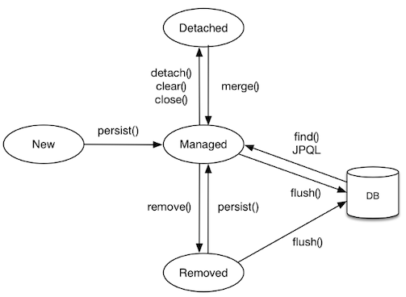

## 1. 영속성 컨텍스트

- 엔티티를 영구 저장하는 환경
- EntityManager를 통해 접근 `entityManager.persist(entity);`
  - J2SE 환경에서는 EntityManager와 영속성 컨텍스트가 일대일
  - J2EE와 Spring 등 컨테이너 환경에서는 여러 개의 EntityManager가 하나의 영속성 컨텍스트와 연결

## 2. 엔티티의 생명 주기



<p align="center" style="color: #888888; font-size: 12px;">
  https://ckck803.github.io/2021/02/16/JPA/persistence/
</p>

### 비영속 (New)

- 영속성 컨텍스트와 전혀 관계가 없는 상태
- 엔티티를 갓 생성한 상태

```java
MyEntity myEntity = new MyEntity();
myEntity.setId(1);
```

### 영속 (Managed)

- 영속성 컨텍스트에 의해 관리되는 상태
- DB에 저장되는 것을 의미하는 것이 아님, 영속성 컨텍스트가 저장하는 것

```java
EntityManager em = emf.createEntityManager(); // EntityManagerFactory emf;
EntityTransaction tx = em.getTransaction();
tx.begin(); // 트랜잭션 시작

em.persist(myEntity); // myEntity 영속 상태로 전환
```

### 준영속 (Detached)

- 영속성 컨텍스트에 저장되었다가 분리된 상태
- 영속성 컨텍스트는 이제 해당 엔티티를 알지 못하므로 변경 감지 등이 수행되지 않음

```java
// myEntity만 준영속 상태로 전환
em.detach(myEntity);

// 영속성 컨텍스트 초기화, 모든 엔티티가 준영속 상태로
em.clear();

// 영속성 컨텍스트 종료, 모든 엔티티가 준영속 상태로
em.close();
```

### 삭제 (Removed)

- DB에 `delete` 쿼리를 날려 삭제된 상태

```java
em.remove(myEntity);
```

## 3. 영속성 컨텍스트의 기능

- 1차 캐시 : 같은 트랜잭션 안에서 한 번 가져왔던 엔티티를 캐싱
- 동일성 보장 : 1차 캐시에 의해, 엔티티를 `==` 비교해도 `true`
- 트랜잭션을 지원하는 쓰기 지연 : 쓰기 쿼리를 모아놨다가 한번에 전송
- 변경 감지 : 엔티티의 변경을 JPA가 자동으로 인식
- 지연 로딩 : 엔티티를 실제 사용하는 시점에 가져옴

## 4. 플러시

- 영속성 컨텍스트의 변경 사항을 DB에 동기화
- 영속성 컨텍스트를 비우지 않으므로 1차 캐시 그대로
- `FlushModeType.AUTO` 모드에서 플러시가 발생하는 시점
  - `em.flush();`
  - 트랜잭션 커밋
  - JPQL 쿼리 실행
- `FlushModeType.COMMIT` 모드에서 플러시가 발생하는 시점
  - 트랜잭션 커밋

## Reference

- [김영한, 자바 ORM 표준 JPA 프로그래밍 - 기본편](https://www.inflearn.com/course/ORM-JPA-Basic)
