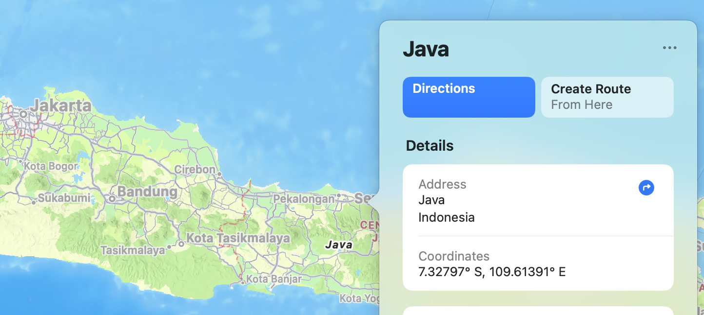
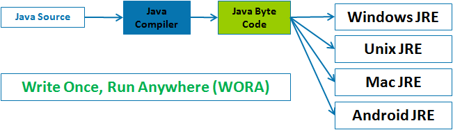
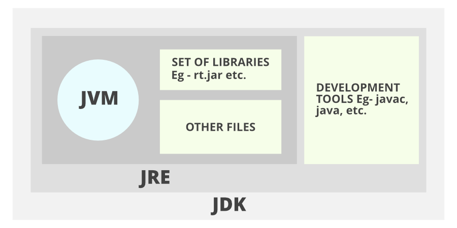

`Java의 정석 (3rd Edition)`을 공부하면서 얻은 내용들을 정리합니다.

## 자바가 뭐야?

### 간단한 역사

자바는 1991년 썬의 엔지니어 제임스 고슬링, 패트릭 노튼, 크리스 와츠, 에드 프랭크, 마이크 쉐리든에 의해 개발되었다.
당시 자바의 목적은 임베디드 환경에서 작동하는 소프트웨어를 만드는 것이었고, 이름도 지금과 다른 Oak로 명명되었다.

비슷한 시기에 팀 버너스리에 의해 WWW(World Wide Web)이 출현하면서
Oak는 플랫폼 독립적이라는 강점을 살려 웹 시장으로 진출하였고, 1995년 Java로 이름을 변경하였다.

현재는 오라클이 썬을 인수하면서 오라클의 소유가 되었다.

### 몇 가지 특징

아직 와닿지 않는 내용들이 몇 가지 있지만
차차 공부하다보면 이해할 수 있을 것 같다.

#### 1. 운영체제에 독립적

자바로 작성된 프로그램은 자바 가상 머신 위에서 실행된다.
윈도우든, 리눅스든, 맥이든 운영체제에 종속되지 않는다.
다시 말해서 자바 프로그램은 자바 가상 머신이 구동되는
어떤 운영체제에서도 실행할 수 있다.

#### 2. 객체지향

객체지향 언어의 특성인 상속, 캡슐화, 다형성이 잘 적용되어 있다.

#### 3. 가비지 컬렉션

프로그래머가 메모리를 직접 관리해줘야 하는 C++ 같은 언어와 달리
가비지 컬렉터가 메모리를 관리한다.

#### 4. 멀티쓰레드

운영체제와 상관 없이 멀티쓰레딩을 적용할 수 있는 API를 제공한다.
쓰레드의 스케줄링 또한 자바 인터프리터가 담당한다.

#### 5. 동적 로딩

실행 시에 모든 클래스를 로딩하지 않고
필요한 시점에 클래스를 로딩하여 사용할 수 있다.
또한 클래스에 변경 사항이 발생해도
모든 클래스를 다시 컴파일하지 않는다.

## 자바의 실행 환경

자바는 JRE(Java Runtime Environment)에서 동작한다.
JRE는 자바 바이트코드를 실행하는 JVM(Java Virtual Machine)과 자바 API로 구성된다.
JRE는 클래스 로더를 통해 자바 어플리케이션을 읽어 자바 API와 함께 실행한다.

  http://java.meritcampus.com/core-java-topics/creation-of-java-as-platform-independence-wora

자바는 `Write once, run anywhere`라는 슬로건과 함께 시작했다.
JVM은 WORA를 실현하기 위한 방법이다. JVM을 `자바 프로그램을 실행하기 위한 가상 컴퓨터`로 이해할 수 있다.
다시 말하면 맥, 리눅스, 윈도우 어느 플랫폼이든 이 JVM이라는 친구를 구동할 수 있다면
자바 프로그램을 실행할 수 있는 것이다.

JVM의 특징과 같은 더 자세한 내용은 [NAVER D2](https://d2.naver.com/helloworld/1230)의 포스트를 참고하자.

## 자바의 개발 환경

JDK(Java Development Kit)를 제공하고 있다.
JDK는 개발을 위한 도구와 함께 자바를 실행하기 위한 JRE도 포함한다.

  https://www.geeksforgeeks.org/differences-jdk-jre-jvm

다음은 JDK에서 제공하는 주요 프로그램들이다.

- `javac` : 자바 컴파일러. 자바 소스 코드를 바이트 코드로 컴파일한다.
- `java` : 자바 바이트코드 인터프리터
- `javap` : 역어셈블러
- `javadoc` : 소스 코드의 주석을 통해 자동으로 문서 생성
- `jar` : 압축 프로그램

오라클뿐만 아니라 다양한 벤더의 JDK를 선택해 사용할 수 있다. 아래 링크 참고.  
[LINE의 OpenJDK 적용기: 호환성 확인부터 주의 사항까지](<https://engineering.linecorp.com/ko/blog/line-open-jdk/#OpenJDK%EC%A0%81%EC%9A%A9%EA%B8%B0(JDKExodusTF)-%EB%B0%B0%ED%8F%AC%EB%B2%84%EC%A0%84%EC%9D%98%EC%A2%85%EB%A5%98%EC%99%80%EC%B0%A8%EC%9D%B4>)

## Reference

- 남궁성, Java의 정석 (3rd Edition), 도우출판
- [자바의 역사와 철학, 안녕 프로그래밍](https://www.holaxprogramming.com/2017/08/16/java-history/)
- [JVM Internal, NAVER D2](https://d2.naver.com/helloworld/1230)
- [LINE의 OpenJDK 적용기: 호환성 확인부터 주의 사항까지](https://engineering.linecorp.com/ko/blog/line-open-jdk/)
