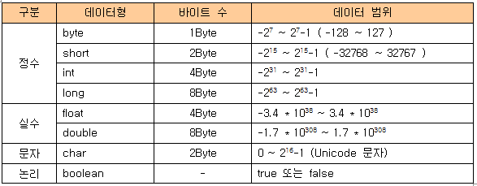

## 변수의 기본 타입



<p align="center" style="color: #888888; font-size: 12px;">
  https://zamezzz.tistory.com/110
</p>

정수형 변수를 사용할때 `byte`나 `short`보다는
`int`를 쓰는게 효율적이라는 말이 있어서 이유가 궁금했는데,
JVM의 피연산자 스택이 피연산자를 4 Byte 단위로 저장한다고 한다.
때문에 `byte`와 `short`를 사용하면 4 Byte로 변환 작업이 발생한다고.

## 변수의 이름

기본 규칙은 다음과 같다.

- 대소문자가 구분되며 길이 제한 없음
- 예약어 사용 불가
- 숫자로 시작할 수 없음
- `_`와 `$` 외의 특수문자 사용 불가

코드의 가독성을 높이고 일관성을 줄 수 있는 네이밍 컨벤션 또한 존재한다.
위 기본 규칙과 달리 문법적으로 강제되는 사항은 아니다.
다양한 컨벤션이 존재하겠지만, Oracle에서 기술하고 있는 내용은 다음과 같다.

> Except for variables, all instance, class, and class constants are in mixed case with a lowercase first letter. Internal words start with capital letters. Variable names should not start with underscore \_ or dollar sign \$ characters, even though both are allowed.
>
> Variable names should be short yet meaningful. The choice of a variable name should be mnemonic- that is, designed to indicate to the casual observer the intent of its use. One-character variable names should be avoided except for temporary "throwaway" variables. Common names for temporary variables are i, j, k, m, and n for integers; c, d, and e for characters.

- camelCase 사용하세요.
- 특수문자로 시작하지 마세요.
- 한 글자 이름처럼 무조건 짧기보다는 뜻을 연상시킬 수 있도록 의미 있는 이름을 사용하세요.

그 밖의 네이밍 컨벤션에 대해서는 [해당 링크](https://www.oracle.com/java/technologies/javase/codeconventions-namingconventions.html)를 참고.

## Wrapper 클래스

위에서 다룬 `int`, `double` 같은 Primitive 타입들을
객체로서 취급해야하는 경우가 발생한다.

- 객체 파라미터가 요구되는 경우
- Reference

자바에서는 각 기본 타입에 대한 Wrapper 클래스를 제공한다.

| 기본 타입 | Wrapper 클래스 |
| :-------: | :------------: |
|   byte    |      Byte      |
|   short   |     Short      |
|    int    |    Integer     |
|   long    |      Long      |
|   float   |     Float      |
|  double   |     Double     |
|   char    |   Character    |
|  boolean  |    Boolean     |

### Boxing과 Unboxing

기본 타입에서 Wapper 클래스의 인스턴스를 생성하는 것을 Boxing,
반대를 Unboxing이라고 한다.

```java
Integer num = new Integer(17);
int n = num.intValue();
```

JDK 1.5부터는 직접 Boxing과 Unboxing을 하지 않아도
컴파일러가 자동으로 처리한다.

```java
Character ch = 'X';
char c = ch;
```

## Reference

- 남궁성, Java의 정석 (3rd Edition), 도우출판
- [Code Conventions for the Java Programming Language: 9. Naming Conventions - Oracle](https://www.oracle.com/java/technologies/javase/codeconventions-namingconventions.html)
- [Wrapper 클래스 - TCP School](http://tcpschool.com/java/java_api_wrapper)
