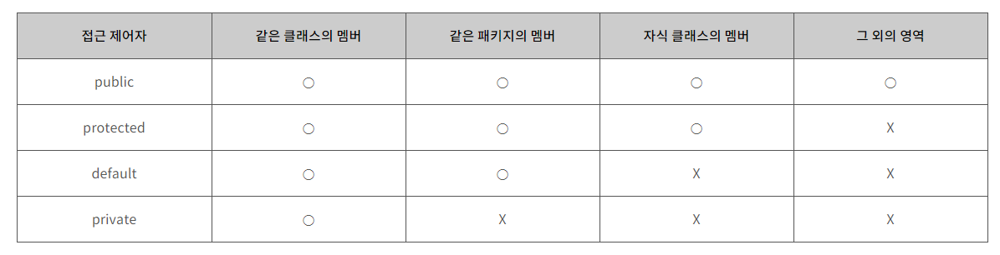

접근 제어자와 그 외의 제어자로 나눌 수 있다.

- 접근 제어자 : public, protected, default, private
- 그 외의 제어자 : static, final, abstract, native, transient, synchronized, volatile, strictfp

여러 개의 제어자를 조합하여 사용할 수 있다. 단, 접근 제어자는 두 개 이상 선택할 수 없다.

## 제어자

### static - 클래스의, 공통적인

인스턴스에 관계 없이 같은 값을 갖는다.
`static`이 붙은 멤버변수, 메서드, 초기화 블럭은
인스턴스와는 관계가 없어 인스턴스를 생성하지 않고도 사용할 수 있다.

### final - 마지막의, 변경될 수 없는

클래스, 메서드, 멤버변수, 지역변수에 사용할 수 있다.

- 변수에 사용되면 상수가 된다.
- 메서드에 사용되면 오버라이딩이 불가능해진다.
- 클래스에 사용되면 자신의 자손 클래스를 정의하지 못한다.

### abstract - 추상의, 미완성의

추상 클래스 혹은 추상 메서드를 만드는데 사용한다.

#### 추상 클래스

```java
abstract class Product { ... }
```

- 추상 클래스는 미완성 설계도와 같다.
- 추상 클래스로는 인스턴스를 생성할 수 없다.
- 새로운 클래스를 작성하기 위한 틀로서 활용할 수 있다.
  새로운 클래스가 추상 클래스를 상속한다.

#### 추상 메서드

```java
abstract void print();
```

메서드의 선언부만을 작성하고 내용은 구현하지 않고 남겨둔 메서드.
해당 추상 메서드를 포함한 추상 클래스를 다른 클래스가 상속하면,
해당 클래스는 추상 메서드들을 오버라이딩하여 구현해야 한다.

## 접근 제어자



<p align="center" style="color: #888888; font-size: 12px;">
  https://velog.io/@sungsuzi/java접근제어자의-종류와-특징
</p>

- private : 같은 클래스 내에서만 접근이 가능하다.
- default : 같은 패키지 내에서만 접근이 가능하다.
- protected : 같은 패키지 내에서, 그리고
  다른 패키지의 자손 클래스에서 접근이 가능하다.
- public : 접근 제한이 전혀 없다.

## Reference

- 남궁성, Java의 정석 (3rd Edition), 도우출판
