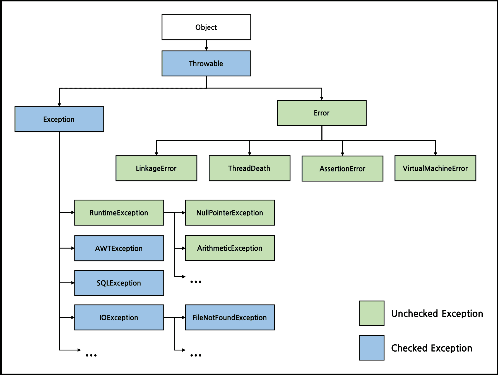

## Error ≠ Exception

에러란 발생시 코드에 의해 수습될 수 없는 심각한 오류를 지칭한다.
발생 시점에 따라 컴파일 에러, 런타임 에러로 나뉘기도 한다.

예외란 발생하더라도 코드에 의해 수습될 수 있는 오류를 지칭한다.
적절한 예외 처리를 통해 프로그램의 비정상적인 종료를 막을 수 있다.

## class Exception

자바에서 발생하는 모든 예외는
Exception 클래스 혹은
Exception 클래스의 자손이다.
계층도는 다음과 같다.



<p align="center" style="color: #888888; font-size: 12px;">
  https://madplay.github.io/post/java-checked-unchecked-exceptions
</p>

RuntimeException 이하 클래스들은
배열의 인덱스 범위를 벗어나거나,
값이 null인 참조변수의 멤버를 호출하는 등
주로 프로그래머의 실수에 의해 발생할 수 있는 예외들이다.

이외 클래스들은 외부의 영향으로 발생할 수 있는 예외들이 많다.
파일이 존재하지 않거나, 입력한 데이터의 형식이 잘못된 경우의 예외들이 있다.

## 예외 처리

```java
public class Calc {
  public static void main(String[] args) {
    int divisor = 0;
    try {
      System.out.println(100 / divisor);
    } catch (ArithmeticException e) {
      System.out.println("divide by zero!");
    }
  }
}
```

`divisor`의 값이 0이므로
100을 0으로 나누는 예외가 발생한다.

만약 `try` 블럭 안의 코드에서 예외가 발생하면
발생한 예외의 클래스에 따라
알맞은 `catch` 블럭에서 처리된다.

위 코드에서는 `ArithmeticException`이 발생한 경우
catch하도록 작성되어 있는데,
만약 해당 예외를 처리할 수 있는 `catch` 블럭이 없으면
예외는 처리되지 않는다.
처리되지 못한 예외는
JVM의 예외처리기(UncaughtExceptionHandler)가 받아
예외의 원인을 출력하게 된다.

여러 종류의 예외를 처리할 수 있도록
하나의 `try` 블럭에
여러 개의 `catch` 블럭을 작성할 수 있다.

```java
try {
  ...
} catch (ArithmeticException e) {
  ...
} catch (NullPointerException e) {
  ...
} catch (Exception e) {
  ...
} finally {
  ... // 항상 실행됨
}
```

> 여러 개의 `catch` 블럭을 사용하는 대신
> `catch (ArithmeticException | NullPointerException e)`와 같이
> 작성하는 방법도 있다. JDK 1.7 이후 지원.

> finally 블럭은 예외가 처리되든 안되든 항상 실행된다.
> 심지어 try 블럭 안에서 return이 발생하는 경우에도.

앞에서 모든 예외는 Exception 클래스 본인이거나
그 자손이라고 언급하였다.
`catch` 블럭에서 어떠한 예외를 처리할 수 있는지의 여부는
`instanceof` 연산에 의해 결정된다.
즉 `catch`에서 Exception 클래스의 예외를 처리하는 경우,
모든 예외가 처리될 수 있다.

위 코드에서 예외가 Uncaught되는 일은 없을 것이다.
차례대로 ArithmeticException,
NullPointerException 클래스의 인스턴스인지 검사를 진행하고,
아닌 경우 Exception 클래스의 블럭에서 처리된다.

> 예외 객체의 `printStackTrace()` 메서드나
> `getMessage()`메서드를 통해 발생한 예외의 정보를 알 수 있다.
> `printStackTrace()`는 예외 발생 시점에 콜스택에 있었던 메서드의 정보와 에러 메시지를 출력한다.
> `getMessage()`는 에러 메시지를 반환한다.

## throw와 throws

1. `throw` 키워드를 통해 예외를 직접 발생시킬 수 있다.
   예외 객체를 생성해 넘겨준다.
2. `throws` 키워드를 통해 메서드에 예외를 선언할 수 있다.
   발생할 수 있는 예외를 메서드 선언부에 명시하여, 해당 메서드 사용시
   프로그래머가 이에 대한 처리를 하도록 강요한다.

```java
int divide(int num) throws Exception{
  Scanner in = new Scanner(System.in);
  int divisor = in.nextInt();
  if (divisor == 0)
    throw new Exception("Divide by zero");
  return num / divisor;
}
```

## try-with-resources

파일과 같이 입출력과 관련된 리소스들은
사용한 후에 닫아 주어야 한다.

```java
try {
  fis = new FileInputStream("score.dat");
  dis = new DataInputStream(fis);

} catch (IOException ie) {
  ie.printStackTrace();

} finally {
  try {
    if (dis != null) dis.close();
  } catch (IOException ie) {
    ie.printStackTrace();
  }
}
```

파일을 사용한 후에 finally 블럭에서
파일을 닫아주고 있다.
파일을 닫는 과정에서도 예외가 발생할 수 있으므로
finally 블럭 안에서 다시 try-catch를 통해
예외 처리를 해주어야 한다.

위 코드의 문제는 다음과 같다.

1. finally 블럭 안에서 예외 처리를 다시 해주는 코드.
   코드가 복잡해져서 보기 좋지 않다.
2. try 블럭과 finally 블럭에서 모두 예외가 발생하면
   try 블럭의 예외는 처리되지 않는다.

try-with-resources문을 통해
코드를 개선하면 다음과 같다.

```java
try (FileInputStream fis = new FileInputStream("score.dat");
    DataInputStream dis = new DataInputStream(fis)) {
  score = dis.readInt();
  System.out.println(score);
  sum += score;
} catch (EOFException e) {
  System.out.println("정수의 총합은 " + sum + "입니다.");
} catch (IOException ie) {
  ie.printStackTrace();
}
```

- try 이후 괄호 안에 객체를 생성하는 코드를 넣으면,
  해당 객체는 try 블럭을 벗어날때 자동으로 close()가 호출된다.
- 객체가 `AutoCloseable` 인터페이스를 구현한 것이어야 한다.
- 두 개 이상의 객체를 생성하는 경우 코드를 세미콜론으로 구분한다.

## 사용자정의 예외 클래스

```java
public class Calc {
  public static void main(String[] args) {
    try {
      System.out.println(divide(100, 0));
    } catch (DivideByZeroException e) {
      e.printStackTrace();
    }
  }

  static int divide(int num, int divisor) throws DivideByZeroException {
    if (divisor == 0)
      throw new DivideByZeroException("divisor is zero");
    return num / divisor;
  }
}

class DivideByZeroException extends Exception {
  DivideByZeroException(String msg) {
    super(msg);
  }
}
```

`DivideByZeroException` 클래스를 생성하였다.
Exception 클래스를 상속하며, `super()`을 통해
Exception 클래스의 생성자를 호출하고 있다.

## Reference

- 남궁성, Java의 정석 (3rd Edition), 도우출판
