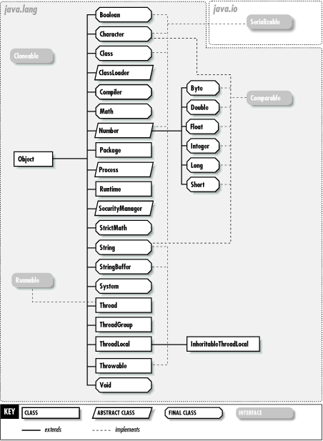
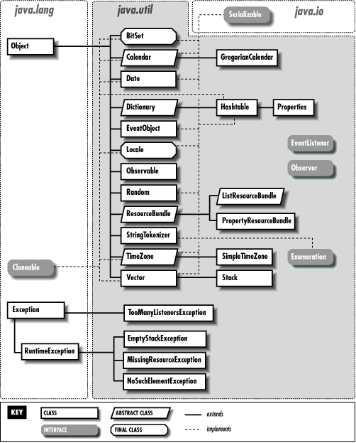

달달 외우는 것보다는
[공식 문서](https://docs.oracle.com/javase/8/docs/api/index.html)
를 찾아보면서 많이 사용해보자.

## java.lang 패키지

  https://docstore.mik.ua/orelly/java-ent/jnut/ch12_01.htm

별도의 import 없어도 사용할 수 있는
자바의 기본적인 클래스들을 포함한다.
모든 클래스의 조상인 Object 클래스,
String 클래스, 각종 Wrapper 클래스 등..

공식 문서를 보며 다음 내용들을 찾아보자.

- `Object` 클래스
- `String` 클래스
- `StringBuffer` 클래스
- `StringBuilder` 클래스
- `Math` 클래스
- 각종 Wrapper 클래스

`Object`, `String`, `StringBuffer`, `StringBuilder`,
`Math`, 그리고 각종 Wrapper 클래스 등에 대해 알아보자.

## java.util 패키지

  http://web.deu.edu.tr/doc/oreily/java/fclass/ch17_js.htm

Collections 프레임워크, 이벤트 모델,
날짜와 시간 관련 메서드와
각종 유틸리티 클래스들을 담고 있다.

공식 문서를 보며 다음 내용들을 찾아보자.

- `Objects` 클래스
- `Random` 클래스
- `regex` 패키지
- `Scanner` 클래스
- `StringTokenizer` 클래스

## java.math 패키지

더 크고 정밀한 수를 다루기 위한
BigInteger와 BigDecimal 클래스를 제공한다.
공식 문서를 찾아보자.

## Reference

- 남궁성, Java의 정석 (3rd Edition), 도우출판
- [Java SE 8 Documentation - Oracle](https://docs.oracle.com/javase/8/docs/api/index.html)
