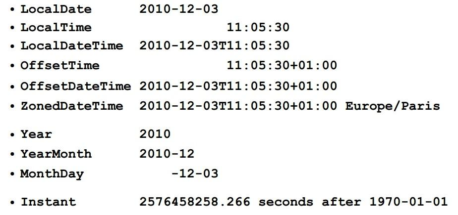
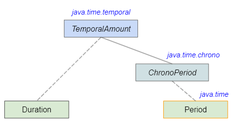

그동안 날짜와 시간을 다루기 위해
자바에서 제공한 API는 다음과 같다.

1. `Date` 클래스 - JDK 1.0부터 제공
2. `Calendar` 클래스 - JDK 1.1부터 제공
3. `java.time` 패키지 - JDK 1.8부터 제공

`java.time` 패키지가 JDK 1.8에서 새로 추가되었지만,
`Date` 클래스와 `Calendar` 클래스 또한 아직 사용되고 있다.

## Calendar 클래스

Calendar는 추상 클래스이다.
즉, 본인의 인스턴스를 생성할 수 없는 것이다.
대신 Calendar를 구현한 클래스의 인스턴스를 반환하는
`getInstance()` 메서드를 제공한다.

```java
Calendar cal = Calendar.getInstance();
```

getInstance가 반환하는 Calendar의 구현체로는
`GregorianCalendar` 클래스와 `BuddhistCalendar`가 있다.

이름에서 유추할 수 있듯 GregorianCalendar는 그레고리력으로,
getInstance는 시스템의 국가와 설정에 따라
태국이 아닌 경우에는 GregorianCalendar를,
태국인 경우에는 BuddhistCalendar를 반환한다.

물론 Calendar.getInstance를 사용하지 않고
직접 GregorianCalendar의 인스턴스를 생성할 수도 있지만,
다른 역법을 사용하는 국가에 대해 호환성을 보장하려면
BuddhistCalendar 인스턴스를 생성하도록 코드를 변경해야 할 것이다.

이런 상황에서 getInstance 메서드를 사용해
최소한의 코드 변경으로 프로그램이 동작할 수 있다는 것을 알고 넘어가자.

Calendar의 사용법에 대해서는 달력을 출력하는 예제를 작성하여 대신한다.
`get()`과 `set()` 메서드 위주로 보면 될 것 같다.

```java
import java.util.Calendar;

public class CalendarCLI {

  public static void main(String[] args) {
    if (args.length < 2) {
      System.out.println("usage: ./CalendarCLI <year> <month>");
    }

    int year = Integer.parseInt(args[0]);
    int month = Integer.parseInt(args[1]);
    printCalendar(year, month);
  }

  static void printCalendar(int year, int month) {
    Calendar start = Calendar.getInstance();
    start.set(year, month - 1, 1);

    Calendar end = Calendar.getInstance();
    end.set(year, month, 1);
    end.add(Calendar.DATE, -1);

    printCalHeader(start);
    printCalBody(start, end);
  }

  static void printCalHeader(Calendar s) {
    int year = s.get(Calendar.YEAR);
    int month = s.get(Calendar.MONTH) + 1;
    final char[] DAY = { ' ', 'S', 'M', 'T', 'W', 'T', 'F', 'S' };

    System.out.printf("[%d.%d]%n", year, month);
    for (int i = 1; i <= 7; ++i)
      System.out.printf("%c\u0020\u0020", DAY[i]);

    System.out.println();
  }

  static void printCalBody(Calendar s, Calendar e) {
    int firstDay = s.get(Calendar.DAY_OF_WEEK);
    int lastDay = e.get(Calendar.DATE);

    for (int i = 0; i < firstDay - 1; ++i)
      System.out.print("\u0020\u0020\u0020");

    for (int i = 1; i <= lastDay; ++i) {
      if (i < 10) System.out.printf("%d\u0020\u0020", i);
      else System.out.printf("%d\u0020", i);
      if ((i + firstDay - 1) % 7 == 0)
        System.out.println();
    }

    System.out.println();
  }

}

```

> #### Calendar와 Date 사이의 변환
>
> Calendar의 출현으로 Date 클래스의 대부분이 deprecated 되었으나
> Date 클래스를 필요로 하는 메서드들이 있다고 한다.
> Calendar와 Date 사이의 변환 방법은 다음과 같다.
>
> 1. Calendar -> Date
>
> ```java
> Calendar cal = Calendar.getInstance();
> Date d = new Date(cal.getTimeInMillis());
> // or Date d = cal.getTime();
> ```
>
> 2. Date -> Calendar
>
> ```java
> Date d = new Date();
> Calendar cal = Calendar.getInstance();
> cal.setTime(d);
> ```

## java.time 패키지

날짜랑 시간 다루는 클래스가 이렇게 많을 줄이야..

java.time과 아래 4개의 하위 패키지는 날짜와 시간에 대한
다양한 클래스들을 제공한다.

- java.time : 날짜와 시간을 다루는 핵심 클래스들 제공
- java.time.chrono : ISO 표준 외의 달력 시스템을 위한 클래스들 제공
- java.time.format : 날짜와 시간 파싱 및 포맷팅 클래스들 제공
- java.time.temporal : 날짜와 시간의 필드와 단위 클래스들 제공
- java.time.zone : 시간대 관련 클래스들 제공

기존 Calendar 클래스와 달리
여기서 다루는 클래스들은 immutable하다.
값이 변경될 일이 있으면 객체를 수정하는 것이 아니라
새로운 객체를 만들어 반환한다.

이러한 특성이 멀티 쓰레드 환경에서는
여러 쓰레드가 동시에 하나의 객체에 접근해도 안전하기 때문에
thread-safe하다고 한다.

### 주요 클래스와 인터페이스

#### 1. 날짜와 시간을 표현하는 클래스



<p align="center" style="color: #888888; font-size: 12px;">
  https://programmer.help/blogs/new-features-of-java-8-date-time-api-for-new-features-of-java-class-libraries.html
</p>

LocalDate와 LocalTime은 각각 날짜와 시간을
표현하고, LocalDateTime은 날짜와 시간을 같이 표현한다.

LocalDateTime에서 시간대를 같이 다뤄야 한다면
ZonedDateTime을 사용한다.

날짜를 좀 더 세부적으로 다루기 위한 Year, YearMonth,
MonthDay 같은 클래스가 제공된다.

Instant 클래스는 날짜와 시간을 타임스탬프로 표현한다.

#### 2. 날짜와 시간의 간격을 표현하는 클래스



날짜와 시간의 간격을 표현하는 클래스로 Period와
Duration 클래스도 제공된다. Period는 날짜의 차이,
Duration은 시간의 차이를 표현한다.

#### 3. Temporal과 TemporalAmount 인터페이스

Period와 Duration은 간격, 즉 양을 나타내므로
TemporalAmount 인터페이스의 구현 클래스이다.

나머지 LocalDate, LocalTime 등의 클래스들은 모두
Temporal & TemporalAccessor & TemporalAdjuster
인터페이스를 구현한다.

> Temporal은 '시간의'라는 뜻을 갖는 형용사이다.

#### 4. TemporalUnit과 TemporalField 인터페이스

TemporalUnit 인터페이스는 날짜와 시간의 단위(unit)을
정의하는 인터페이스이다. ChronoUnit 열거형(Enum)이
TemporalUnit 인터페이스를 구현한다.

TemporalField 인터페이스는 날짜와 시간의 필드를
정의하는 인터페이스이다. ChronoField 열거형이 구현한다.

단위와 필드의 차이가 조금 애매하게 느껴졌는데,
아래 예제를 참고하였다.

```java
// ChronoUnit을 사용해서
// 1 '일'을 더했음
LocalDate today = LocalDate.now();
LocalDate tomorrow = today.plus(1, ChronoUnit.DAYS);

// ChronoField를 사용해서
// MINUTE_OF_HOUR라는 필드를 선택해 가져옴
LocalTime now = LocalTime.now();
int minute = now.get(ChronoField.MINUTE_OF_HOUR);
```

### LocalDate와 LocalTime

LocalDate와 LocalTime의 사용법에 대해 알아보자.
가장 기본이 되는 클래스이므로, 이후 나머지 클래스들을 사용할때도
참고가 될 수 있다.

#### 1. now()와 of() 그리고 parse()

먼저 객체의 생성 방법이다.
now()는 현재, of()는 주어진 값으로 객체를 생성한다.

```java
LocalDate today = LocalDate.now();
LocalTime lunchTime = LocalTime.of(13, 30, 0);
```

parse()를 사용해 주어진 문자열에서 객체를 생성할 수도 있다.

```java
LocalDate nowDate = LocalDate.parse("2021-12-27");
LocalTime nowTime = LocalTime.parse("16:54:30");
```

#### 2. get()

get()을 통해 특정 필드의 값을 가져올 수 있다.

```java
LocalDate today = LocalDate.now();
int date = today.get(ChronoField.DAY_OF_MONTH);

// 예외 발생: LocalDate에서 시간을 가져올 수는 없음
int hour = today.get(ChronoField.HOUR_OF_DAY);
```

단 클래스가 모든 필드를 지원하지 않을 수 있다는 것을 유의하자.
가령 LocalDate 클래스의 인스턴스에서 몇 시인지를 알아낼 수는 없다.

필드의 정의는 ChronoField 열거형을 사용한다.
필드의 목록은 [공식 문서](https://docs.oracle.com/javase/8/docs/api/java/time/temporal/ChronoField.html)
를 참고.

필드를 인자로 넘기는 것이 아니라
getYear(), getMonth(), getDayOfMonth() 등
getXXX() 형태의 메서드들도 제공하니 필요에 따라 조사해 사용할 것.

#### 3. with(), plus(), minus()

특정 필드의 값을 변경하기 위한 방법이다.

> 변경이라고는 했지만, 모두 immutable 하므로 실제로는
> 새로운 객체가 생성되는 방식이다.
> 따라서 항상 `date = date.plus(...)`처럼
> 새로 생성된 객체를 assign 해주어야 한다.

with() 메서드를 통해 원하는 값으로 필드의 값을 변경한다.

```java
LocalDate date = LocalDate.now();
// 2010년으로 변경
date = date.with(ChronoField.YEAR, 2010);
// or date = date.withYear(2010);
```

plus()와 minus()는 주어진 값만큼
필드의 값을 증가/감소시킨다.

```java
LocalDate date = LocalDate.now();
// 3일 뒤로
date = date.plus(3, ChronoUnit.DAYS);
// or date = date.plusDays(3);
```

plus()와 minus()는 TemporalAmount 타입의 인자를
받기도 한다.

> LocalTime은 truncatedTo() 메서드를 제공한다.
> 주어진 필드보다 작은 단위의 필드를 모두 0으로 만든다.
> LocalDate에서는 값이 0이 될 수 있는 필드가 없기 때문에
> 제공하지 않는다. 자세한 내용은 검색.

#### 4. isAfter(), isBefore(), isEqual()

isAfter() 또는 isBefore()을 사용해
두 날짜를 비교할 수 있고,
compareTo() 또한 오버라이딩되어 있어
사용 가능하다.

날짜가 같은지 비교할때는 isEqual()을 사용한다.
equals()를 사용해도 대부분의 경우 같은 결과를 얻을 수 있지만,
연표가 다른 두 날짜를 비교하려면 isEqual()이 필요하다.
(ex. JapaneseDate)

### Instant 클래스

- 에포크 타임(1970-01-01 00:00:00 UTC)
  으로부터 경과된 시간을 나노초 단위로 표현한다.
- 날짜와 시간의 계산에 더 편리한 부분이 있다.
- UTC(+00:00)를 기준으로 하기에 LocalTime과 차이가 있을 수 있다.
- getEpochSecond(), toEpochMilli(), getNano()를 통해 각각
  초, 밀리초, 나노초 단위의 값을 얻을 수 있다.
- Date와 서로 변환할 수 있는 메서드가 제공된다.

### LocalDateTime 클래스

LocalDate와 LocalTime의 개념을 합친 것이
LocalDateTime이다.

기본적인 메서드들은 앞서 LocalDate와 LocalTime에서 다룬 것들을
사용할 수 있다.

추가로 LocalDate와 LocalTime을 합쳐 LocalDateTime을 만들거나,
그 반대의 기능을 하는 메서드들이 제공된다.

```java
LocalDate date = LocalDate.now();
LocalTime time = LocalTime.now();

// LocalDate + LocalTime -> LocalDateTime
LocalDateTime dt = LocalDateTime.of(date, time);
LocalDateTime dt2 = date.atTime(time);
LocalDateTime dt3 = time.atDate(date);
LocalDateTime dt4 = date.atStartOfDay();

// LocalDateTime -> LocalDate, LocalTime
LocalDate date2 = dt.toLocalDate();
LocalTime time2 = dt.toLocalTime();
```

### ZonedDateTime 클래스

LocalDateTime에 시간대 개념을 추가한 것이
ZonedDateTime이다.

시간대를 다루기 위해 ZoneId라는 클래스를 사용한다.
서머타임도 자동으로 처리해준다고 한다.

```java
ZoneId zid = ZondId.of("Asia/Seoul");
ZonedDateTime zdt = dateTime.atZone(zid);
```

현재 뉴욕의 시간을 알고 싶다면..

```java
ZoneId nyId = ZondId.of("America/New_York");
ZonedDateTime nyTime = ZonedDateTime.now().withZoneSameInstant(nyId)
```

### TemporalAdjusters 클래스

TemporalAdjusters 클래스를 통해
날짜 계산에 편리한 다양한 메서드를 제공한다.
이를테면 다음 주 월요일의 날짜를 구하는 코드를
간단히 작성할 수 있다.

자세한 내용은 [공식 문서](https://docs.oracle.com/javase/8/docs/api/java/time/temporal/TemporalAdjusters.html)
를 참고하자.

TemporalAdjuster 인터페이스를 구현하여
직접 필요한 클래스를 만들 수도 있다.

### Period와 Duration 클래스

앞서 말한대로 날짜와 시간의 간격을 표현하는 클래스이다.

Period는 between() 또는 until()을 통해 생성할 수 있다.
Duration은 until()을 사용할 수 없다.

```java
Period p1 = Period.between(date1, date2);
Period p2 = date1.until(date2);

Duration d = Duration.between(time1, time2);
```

앞에서 다룬 get(), plus(), minus() 등의 메서드를 지원한다.
추가적으로..

- Duration은 초와 나노초 단위로만 get할 수 있다.
  Duration을 LocalTime으로 변경해 get하는 방법도 있다.
- plus()와 minus() 외에 곱셈과 나눗셈을 위한 메서드를 제공한다.
- 다른 단위로 변환하기 위한 toXXX() 메서드들을 제공한다.

## Reference

- 남궁성, Java의 정석 (3rd Edition), 도우출판
