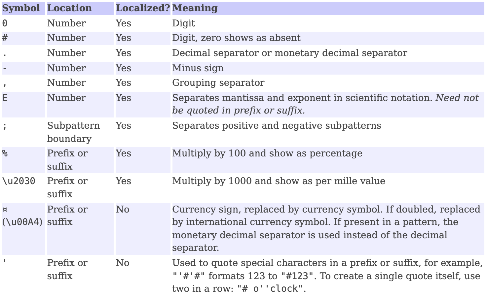
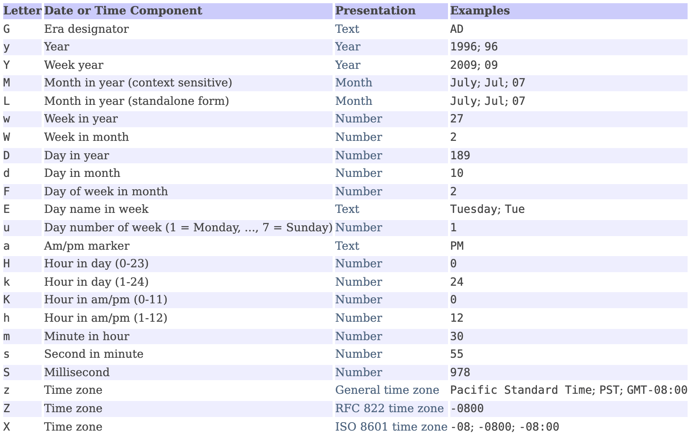
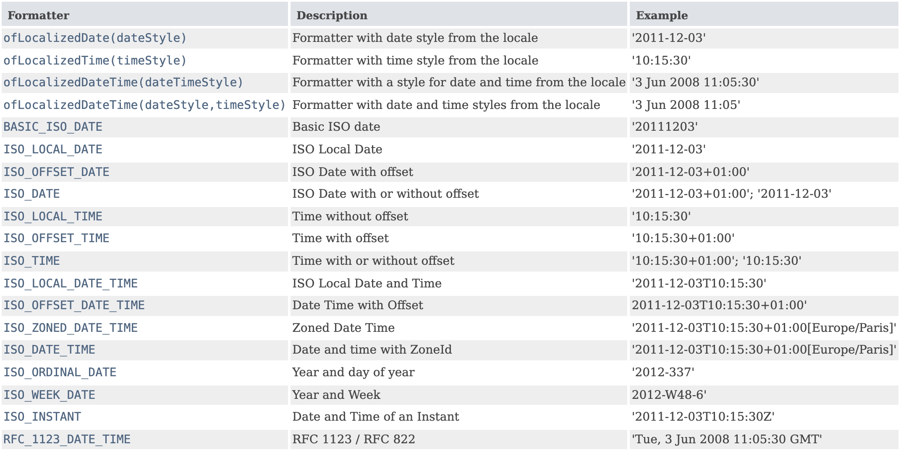

숫자와 날짜 등을 포맷팅하거나
문자열로부터 파싱하기 위한 형식화 클래스들을 소개한다.

## DecimalFormat 클래스

숫자를 포맷팅하는 클래스이다.
아래 표의 기호를 사용해 알맞은 패턴을 작성한다.



<p align="center" style="color: #888888; font-size: 12px;">
  https://docs.oracle.com/javase/8/docs/api/java/text/DecimalFormat.html
</p>

```java
double number = 1234567.89;
DecimalFormat df = new DecimalFormat("#.#E0");
String result = df.format(number); // 1.2E6
```

반대로 문자열에서 숫자로 파싱하는 것도 가능하다.

```java
DecimalFormat df = new DecimalFormat("#,###.##");

try {
  Number num = df.parse("1,234,567.89");
  double d = num.doubleValue(); // 1234567.89
} catch (Exception e) {}
```

> Number 클래스는 Integer, Double 등 래퍼 클래스들의 조상이며,
> doubleValue()나 intValue(), floatValue() 등의 메서드를 통해
> Number 타입에서 원시 타입의 값을 얻을 수 있다.

## SimpleDateFormat 클래스

날짜를 포맷팅하는 클래스이다.



<p align="center" style="color: #888888; font-size: 12px;">
  https://docs.oracle.com/javase/8/docs/api/java/text/SimpleDateFormat.html
</p>

```java
Date today = new Date();
SimpleDateFormat df = new SimpleDateFormat("yyyy-mm-dd");

String result = df.format(today);
```

Date 타입만이 사용될 수 있기 때문에
Calendar 등의 타입인 경우 Date로 변환하여야 한다.

파싱 또한 가능하다.

```java
SimpleDateFormat df = new SimpleDateFormat("yyyy-mm-dd");

try {
  Date d = df.parse("2021-12-27");
} catch (Exception e) {}
```

## ChoiceFormat 클래스

특정 범위에 속하는 값을 문자열로 변환해준다.
if문으로 성적 구간에 대한 등급을 출력해봤던 것을 생각하면 쉽다.

```java
double[] limits = { 60, 70, 80, 90 };
String[] grades = { "D", "C", "B", "A" };
int[] scores = { 100, 95, 88, 70, 52, 60 };

ChoiceFormat form = new ChoiceFormat(limits, grades);

for (int i = 0; i < scores.length; ++i) {
  System.out.println(form.format(scores[i]));
}
```

- `limits`는 오름차순으로 정렬되어 있어야 한다.
- `limits`와 `grades` 배열의 길이가 같아야 한다.
- `#`와 `<` 구분자로 패턴을 작성하는 방법도 있다.

## MessageFormat 클래스

데이터를 정해진 양식에 맞게 포맷팅하는 클래스.
일반적인 문자열 포맷팅을 생각하면 될 것 같다.

```java
String msg = "Name: {0}, Age: {1}\n";
Object[] arguments = {
  "James", "20"
};
String result = MessageFormat.format(msg, arguments);
```

DecimalFormat이나 SimpleDateFormat과
비슷한 방식으로 파싱도 가능하다.

## java.time.format 패키지

앞서 SimpleDateFormat을 통한 날짜 포맷팅 방법이 있었지만,
java.time.format 패키지의 클래스들을 통해 포맷팅과 파싱이 가능하다.
그 중에서도 DateTimeFormatter 클래스가 핵심이다.

```java
LocalDate date = LocalDate.now();
// 2021-12-27
String s1 = DateTimeFormatter.ISO_LOCAL_DATE.format(date);
String s2 = date.format(DateTimeFormatter.ISO_LOCAL_DATE);
```

DateTimeFormatter에서
사용 가능한 formatter는 다음과 같다.



<p align="center" style="color: #888888; font-size: 12px;">
  https://docs.oracle.com/javase/8/docs/api/java/time/format/DateTimeFormatter.html
</p>

- ofLocalizedXXX()를 사용하면
  로케일에 따라 다르게 포맷팅할 수 있다.
- ofPattern()으로 원하는 형식을 작성할 수 있다.
  패턴 기호에 대해서는 [공식 문서](https://docs.oracle.com/javase/8/docs/api/java/time/format/DateTimeFormatter.html)를 참고.
- LocalDate 등의 클래스에 정의된 parse() 메서드에
  formatter를 인자로 넘겨 파싱이 가능하다.

## Reference

- 남궁성, Java의 정석 (3rd Edition), 도우출판
