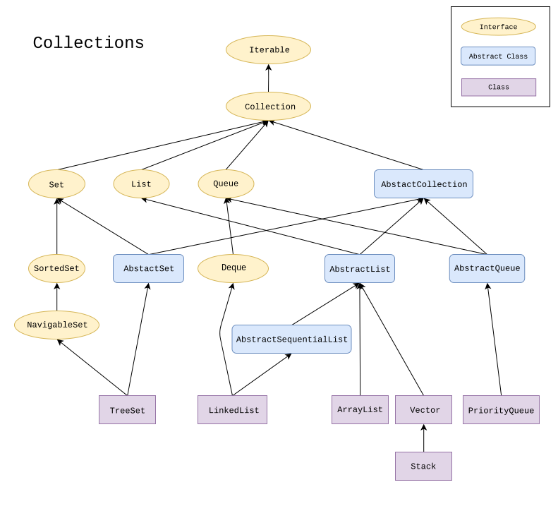
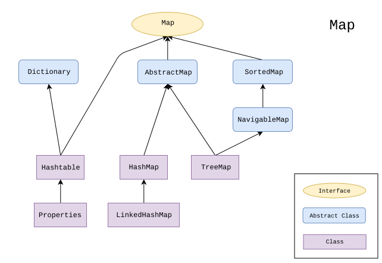
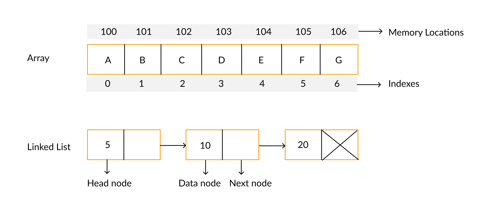

- 자료구조
- 다수의 데이터, 즉 컬렉션을 다루는 여러 가지 클래스를 제공
- 인터페이스와 다형성을 이용한 객체지향적 설계로 인해 재사용성이 높은 코드 작성 가능

`Collection` 인터페이스와 `Map` 인터페이스로
나눌 수 있다.



<p align="center" style="color: #888888; font-size: 12px;">
  https://en.wikipedia.org/wiki/Java_collections_framework
</p>



<p align="center" style="color: #888888; font-size: 12px;">
  https://en.wikipedia.org/wiki/Java_collections_framework
</p>

[Collection](https://docs.oracle.com/javase/8/docs/api/java/util/Collection.html),
[Set](https://docs.oracle.com/javase/8/docs/api/java/util/Set.html),
[List](https://docs.oracle.com/javase/8/docs/api/java/util/List.html),
[Map](https://docs.oracle.com/javase/8/docs/api/java/util/Map.html) 등의 인터페이스에
어떤 메서드가 정의되어 있는지 공식 문서를 참고해봐도 좋다.

## ArrayList와 LinkedList



<p align="center" style="color: #888888; font-size: 12px;">
  https://www.faceprep.in/data-structures/linked-list-vs-array/
</p>

### ArrayList

기존 Vector 클래스를 개선한 것이며,
C++에서 자주 사용했던 `vector`를 생각해도 좋을 것 같다.
내부 구현이 배열이니까.

배열로 구현되어 있다는 점이
ArrayList의 특징 몇 가지를 시사하는데..

- 데이터가 순차적으로 저장됨
- 임의의 위치(인덱스)에 접근하는 연산이 빠름
- 끝 부분에 데이터를 추가/삭제하는 연산은 빠르지만,
  임의의 위치에 대한 추가/삭제는 느릴 수 있음
- 주어진 공간이 부족하면 더 큰 배열을 생성해 저장하는데,
  이때 데이터를 새 배열로 복사하는 비용이 소요
- 배열을 확장하는 비용을 줄이기 위해 메모리를 넉넉하게 잡으면,
  메모리가 낭비될 수 있음

### LinkedList

메모리에 불연속적으로 존재하는
노드 형태의 데이터들이 서로 연결되어 있는 형태의 자료구조.

각 노드가 다음 순서의 노드를 참조하고 있는 구조를 단일 연결 리스트,
이전 순서의 노드도 참조하고 있는 구조를 이중 연결 리스트라고 일컫는다.
자바의 LinkedList 클래스는 이중 연결 리스트로 구현되어 있다.

추가적인 내용들까지 정리해보면..

- 데이터가 불연속적으로 저장됨
- 임의의 위치에 접근하는 연산이 오래 걸림
- 어떤 위치에서도 데이터를 추가/삭제하는 연산을 빠르게 수행
- 딱 필요한 만큼의 메모리를 사용

## Stack과 Queue

### Stack

- LIFO(Last In First Out) 구조의 자료구조
- Stack 클래스 사용

```java
Stack s = new Stack();
s.push("0");
s.push("1");
s.push("2");

while (!s.empty())
  System.out.println(s.pop());
```

### Queue

- FIFO(First In First Out) 구조의 자료구조
- Queue 인터페이스의 구현 클래스를 사용함

```java
Queue q = new LinkedList();
q.offer("0");
q.offer("1");
q.offer("2");

while (!q.isEmpty())
  System.out.println(q.poll());
```

## Iterator

컬렉션의 데이터를 읽어오기 위한 표준화된 방법.
Collection 인터페이스에 Iterator를 반환하기 위한
`iterator()` 메서드가 정의되어 있다.

```java
Collection c = new ArrayList();
Iterator it = c.iterator();

while (it.hasNext())
  System.out.println(it.next());
```

## Enumeration과 ListIterator

Enumeration은 Iterator의 구버전이므로,
가능하면 Enumeration 대신 Iterator을 사용하자.

ListIterator는 Iterator에 양방향 조회 기능을 추가한 것으로서,
List 인터페이스를 구현한 클래스에 한해 사용할 수 있다.

```java
ArrayList list = new ArrayList();
list.add("a");
list.add("b");
list.add("c");
list.add("d");

ListIterator it = list.listIterator();

while (it.hasNext())
  System.out.println(it.next());

while (it.hasPrevious())
  System.out.println(it.previous());
```

## Arrays 클래스

배열을 다루는데 유용한 메서드가 정의되어 있다.

| 메서드         | 기능                                                                    |
| -------------- | ----------------------------------------------------------------------- |
| copyOf()       | 배열 전체를 복사한 새로운 배열을 만들어 반환                            |
| copyOfRange()  | 배열 일부를 복사한 새로운 배열을 만들어 반환                            |
| fill()         | 배열을 지정된 값으로 채움                                               |
| setAll()       | 배열을 채우는데 사용할 함수형 인터페이스를 받아 배열을 채움             |
| sort()         | 배열을 정렬                                                             |
| binarySearch() | 배열을 이분 탐색 (사전에 정렬 필요)                                     |
| equals()       | 배열의 모든 요소를 비교                                                 |
| toString()     | 배열을 문자열로 출력                                                    |
| deepToString() | 다차원 배열도 문자열로 출력 가능                                        |
| asList()       | 배열의 요소들을 List에 담아 반환                                        |
| parallelXXX()  | 여러 쓰레드를 사용해 처리                                               |
| spliterator()  | 여러 쓰레드로 처리할 수 있게 작업을 여러 개로 나누는 Spliterator를 반환 |
| stream()       | 컬렉션을 스트림으로 반환                                                |

## Comparable과 Comparator

기본 정렬 기준을 구현하는데 사용하는
Comparable 인터페이스를 제공한다.
Integer와 같은 클래스에 Comparable의
`compareTo()` 메서드가 정의되어 있다.

기본 정렬 기준 외에 다른 정렬 기준을 사용하기 위한
Comparator 인터페이스를 제공한다.
예를 들면 배열을 오름차순이 아닌 내림차순으로 정렬하고자 할때 사용할 수 있다.

## Reference

- 남궁성, Java의 정석 (3rd Edition), 도우출판
