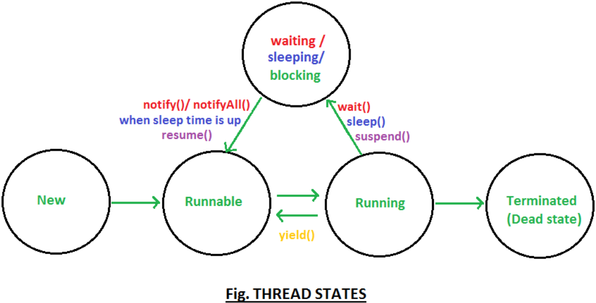

모든 프로세스에는 최소 하나 이상의 쓰레드가 존재하며,
둘 이상의 쓰레드를 가진 프로세스를 멀티쓰레드 프로세스라고 한다.

`main` 메서드 또한 쓰레드를 통해 실행되며,
이를 main 쓰레드라고 한다.

## 쓰레드 구현

쓰레드를 구현하는 방법을 크게 두 가지로 나누면..

1. Thread 클래스 상속
2. Runnable 인터페이스의 구현 클래스 작성,
   그리고 그 인스턴스를 통해 Thread 객체 생성

다중 상속의 불가로 Thread 클래스를 상속하면
다른 클래스를 상속받을 수 없기 때문에
Runnable 인터페이스를 사용하는 방법이 일반적이라고 한다.
또한 재사용성이 높고 코드의 일관성을 유지할 수 있다고 하는데
아직 와닿지는 않는다.

```java
public class Playground {
  public static void main(String[] args) {
    Thread th1 = new MyThread();
    Thread th2 = new Thread(new MyRunnable());

    th1.start();
    th2.start();
  }
}

class MyThread extends Thread {
  @Override
  public void run() {
    for (int i = 1; i <= 5; ++i) {
      System.out.println(getName() + " : " + i);
    }
  }
}

class MyRunnable implements Runnable {
  @Override
  public void run() {
    for (int i = 1; i <= 5; ++i) {
      System.out.println(Thread.currentThread().getName() + " : " + i);
    }
  }
}
```

- 두 방법 공통적으로 `run()`을 구현해야 한다.
- MyThread는 Thread의 자손 클래스이므로 직접 `getName()`을 호출했지만,
  MyRunnable은 `Thread.currnetThread()`을 통해 접근하고 있다.
- `run()`을 구현했지만, 실제 실행은 `start()`를 통해 이루어진다.
  `start()`를 통해 독립적인 콜 스택에서 `run()`이 실행된다.
  쓰레드마다 다른 콜 스택을 가진다는 점이 흥미롭다.

## 싱글 쓰레드와 멀티 쓰레드

멀티 쓰레드 프로세스에서는
여러 개의 쓰레드가 작업을 나누어 처리한다.
효율적으로 들리지만, 항상 싱글 쓰레드 프로세스보다
빠르다고 장담할 수 없다.

프로세스 혹은 쓰레드가 전환되는 것을
컨텍스트 스위칭이라고 한다.
작업의 상태와 프로그램 카운터 등을 저장하고 불러오는
작업이 수행되며, 이는 오버헤드가 된다.

성능이 CPU에 의존적인 프로그램이라면
싱글 코어 프로세서에서는 오히려
싱글 쓰레드로 프로그래밍하는 것이 효율적일 것이다.

또한 멀티 코어 프로세서를 갖추고 있다고 하더라도
여러 쓰레드가 하나의 자원을 가지고 작업해야 하는 경우라면
멀티 쓰레드를 사용하는 것이 득이 되지 않을 수 있다.

## 쓰레드의 우선 순위

```java
void setPriority(int newPriority)
int getPriority()

public static final int MAX_PRIORITY = 10;
public static final int NORM_PRIORITY = 5;
public static final int MIN_PRIORITY = 1;
```

우선 순위가 높은 쓰레드는 더 많은 작업 시간을 가질 수 있다.
`setPriority()`를 통해 우선 순위를 직접 설정할 수 있다.

별도의 우선 순위를 설정하지 않는 경우,
자신을 생성한 쓰레드의 우선 순위를 갖는다.
main 쓰레드의 우선 순위는 5로 설정되어 있다.

자바는 플랫폼 독립적인 언어이지만
쓰레드의 스케쥴링은 운영체제에 종속적인 부분이다.
높은 우선 순위를 주면 항상 더 많은 작업 시간을 가질 거라고
장담할 수는 없다.
운영체제의 스케쥴링 정책과 JVM 구현에 따라 상이할 수 있다.

## 쓰레드 그룹

쓰레드 그룹을 통해 관련된 쓰레드들을 그룹으로 묶을 수 있다.
쓰레드 그룹 안에 쓰레드 그룹을 포함하는 것도 가능하다.
보안 측면의 장점으로
쓰레드는 자신이 속한 쓰레드 그룹이나 하위 쓰레드 그룹은 변경할 수 있지만
다른 쓰레드 그룹의 쓰레드를 변경할 수 없다.

`ThreadGroup` 클래스가 제공된다. [공식 문서](https://docs.oracle.com/javase/8/docs/api/java/lang/ThreadGroup.html)

```java
ThreadGroup main = Thread.currentThread().getThreadGroup();
ThreadGroup grp1 = new ThreadGroup("Group 1");
ThreadGroup grp2 = new ThreadGroup("Group 2");

ThreadGroup subGrp1 = new ThreadGroup(grp1, "SubGroup 1");
Thread th = new Thread(grp2, new MyRunnable(), "Thread");
```

## 데몬 쓰레드

다른 쓰레드의 작업을 돕는 보조적인 역할의 쓰레드이다.
일반 쓰레드(비 데몬 쓰레드)가 모두 종료되면 자동적으로 종료된다.

일반 쓰레드와 생성과 실행 방법이 같으나
실행 전에 `setDaemon()` 메서드를 호출해야 한다는 점이 다르다.

```java
Thread th = new Thread(new MyRunnable());
th.setDaemon(true);
th.start();
```

## 쓰레드의 생명 주기



<p align="center" style="color: #888888; font-size: 12px;">
  https://link2me.tistory.com/1730
</p>

쓰레드의 생명 주기를 나타낸 것이다.
각 원 안의 텍스트는 쓰레드의 상태를 나타내며,
화살표의 메서드를 통해 상태간 전이가 발생한다.

1. New : 쓰레드 객체가 생성되었으나 `start()`가 호출되지 않았다.
2. Runnable : 실행 가능한 상태로 대기열 큐에서 기다리는 중이다. Ready!
3. Running : 실행 중인 상태이다.
4. Waiting : I/O Block 등에 의한 일시정지 상태이다.
   일시정지가 끝나면 다시 대기열에 들어가 Runnable 상태가 된다.
5. Terminated : 쓰레드의 작업이 종료되었다.

상태의 전이를 위해 사용되는 메서드는 다음과 같다.

- `sleep()`을 사용해 일정 시간동안 쓰레드를 정지시킨다.
- `interrupt()`를 사용해 실행중인 쓰레드의 작업을 취소한다.
- `suspend()`, `resume()`, `stop()`을 통해 쓰레드를 정지시키거나 다시 실행대기시킨다.
  Deprecated.
- `yeild()`를 사용해 실행 중인 쓰레드의 남은 실행 시간을 다음 차례 쓰레드에게 양보한다.
- `join()`을 통해 실행중인 쓰레드의 작업을 멈추고 다른 쓰레드가 일정 시간동안 작업을 수행하도록 기다린다.

## Reference

- 남궁성, Java의 정석 (3rd Edition), 도우출판
- [ThreadGroup (Java Platform SE 8) - Oracle](https://docs.oracle.com/javase/8/docs/api/java/lang/ThreadGroup.html)
