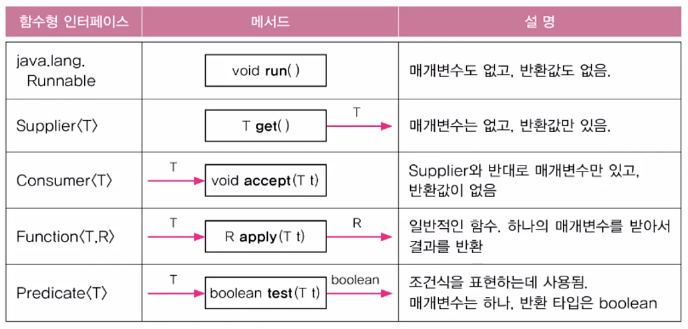
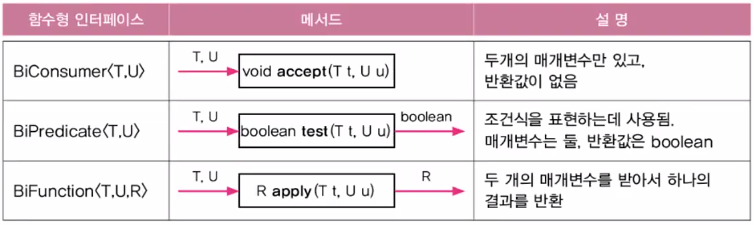
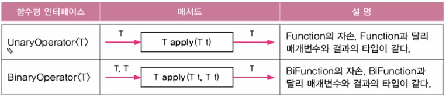
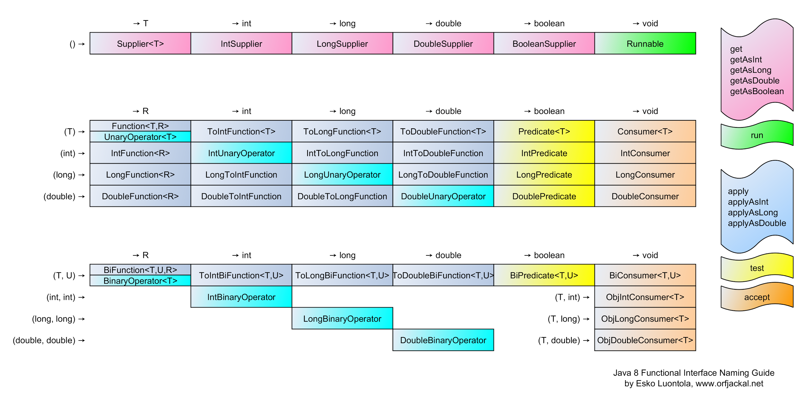

JDK 1.8에서 람다식이 추가되어
자바는 객체지향언어인 동시에 함수형 언어의 기능을 갖추게 되었다.

람다식이란 메서드를 하나의 expression으로 표현한 것이다.
간략하면서도 명확하게 함수를 표현할 수 있다.
메서드의 이름과 반환값이 없어지므로 익명 함수라고도 한다.

## 람다식 문법

```java
// (PARAMETERS) -> {
//   STATEMENTS
// }
(int a, int b) -> {
  return a + b;
}
```

#### 1. 반환값이 있는 경우 return 대신 expression만으로 대체 가능

```java
(int a, int b) -> a + b
```

return 대신에 중괄호를 없애고
expression만 적어서 대체할 수 있다.
statement가 아니므로 세미콜론은 붙이지 않는다.

#### 2. 매개변수의 타입은 추론 가능한 경우 생략 가능

```java
(a, b) -> a + b
```

매개변수 타입이 추론 가능한 경우
매개변수의 타입을 생략할 수 있으며,
대부분의 경우 추론 가능하다.

#### 3. 매개변수가 하나뿐인 경우 괄호 생략 가능

```java
a -> a * a
int a -> a * a // error
```

매개변수가 하나인 경우
매개변수를 둘러싼 괄호를 생략할 수 있다.
단 매개변수의 타입을 생략한 경우에만 허용된다.

#### 4. 중괄호 안의 문장이 하나인 경우 중괄호 생략 가능

```java
(String name) ->
  System.out.println("Hello, " + name)
```

statement가 하나인 경우
중괄호를 생략할 수 있다. 세미콜론은 붙이지 않는다.

## 함수형 인터페이스

람다식을 변수에 저장하거나, 함수에서 반환하고 싶다면
어떻게 해야 할까?

람다식은 메서드와 비슷한 형태를 띄고 있지만
실제로는 익명 클래스의 객체와 동등하다.

```java
// 람다식
(int a, int b) -> a + b

// 익명 클래스의 객체와 동등하다
// 실제로 new Object()는 아님
new Object() {
  int add(int a, int b) {
    return a + b;
  }
}
```

익명 객체도 객체이므로
참조 변수에 저장할 수 있을 것이다.
하지만 참조 변수의 타입이 무엇이 되어야 하는지
알 수가 없다.

```java
타입 f = (int a, int b) -> a + b;
```

이 익명 객체의 타입은
**함수형 인터페이스**를 통해 정의한다.

```java
public class Playground {
  public static void main(String[] args) {
    MyFunction f = (int a, int b) -> a + b;
//  아래와 같음
//  MyFunction f = new MyFunction() {
//    public int add(int a, int b) {
//      return a + b;
//    }
//  };
  }
}

@FunctionalInterface
interface MyFunction {
  int add(int a, int b); // public abstract 생략 가능
}
```

함수형 인터페이스 MyFunction 안에
추상 메서드 `add()`를 정의하였다.
`add()`는 앞서 작성한 람다식과
메서드 선언부가 일치하기 때문에
람다식으로 대체가 가능한 것이다.

함수형 인터페이스에서
추상 메서드는
람다식과 선언이 일치하는
단 하나만 정의되어 있어야 한다.
(디폴트, static 메서드는 제약 없음)
또한 `@FunctionalInterface` 어노테이션을 통해
컴파일러가 MyFunction을 함수형 인터페이스로 인식하여,
함수형 인터페이스가 올바르게 정의되었는지 체크한다.

람다식을 메서드의 매개변수로 사용하거나
반환할 수도 있다.

```java
public class Playground {
  public static void main(String[] args) {
    MyFunction f = getSquareFunc();

    int[] arr = { 1, 2, 3, 4, 5 };
    int[] result = intMap(arr, f);

    for (int i = 0; i < result.length; ++i)
      System.out.print(result[i] + " ");
  }


  // 람다식을 반환하는 메서드
  static MyFunction getSquareFunc() {
    MyFunction f = x -> x * x;
    return f;
  }

  // 람다식을 매개변수로 받아 map하는 메서드
  static int[] intMap(int[] arr, MyFunction f) {
    int[] result = new int[arr.length];
    for (int i = 0; i < arr.length; ++i)
      result[i] = f.func(arr[i]);
    return result;
  }
}

@FunctionalInterface
interface MyFunction {
  int func(int x);
}
```

> #### 람다식의 타입과 형변환
>
> 함수형 인터페이스로 람다식을 참조할 수 있지만,
> 함수형 인터페이스와 람다식의 타입이 일치하는 것은 아니다.
> 따라서 형변환이 필요한데, 생략이 가능하다.
>
> ```java
> MyFunction f = (MyFunction)(()->{}); // 형변환 생략 가능
> ```
>
> 그리고 람다식은 분명 객체이지만, Object로 형변환할 수 없다.
> 굳이 한다면 함수형 인터페이스로 형변환 후에 Object로 형변환이 가능하다.

## 람다식에서 외부 변수 접근

람다식 내에서 참조하는 지역변수는
`final`이 붙지 않아도 상수로 간주되어,
값의 변경이 불가능함에 유의하자.

또한 람다식 매개변수의 이름을
외부 지역변수와 같은 이름으로 지을 수 없다.

```java
void method(int i) {
  int val = 30; // final int val = 30;
  i = 10; // error (i가 상수로 취급되므로 값 변경 불가)

  MyFunction f = (i) -> { // error (외부 지역변수 i와 이름이 같음)
    System.out.println(val);
    System.out.println(i);
  }
}
```

## java.util.function 패키지

### 다양한 함수형 인터페이스 제공

일반적으로 많이 사용되는 함수형 인터페이스들을
java.util.function 패키지에 정의해놓았다.



<p align="center" style="color: #888888; font-size: 12px;">
  https://velog.io/@oyeon/14-78-java.util.function-%ED%8C%A8%ED%82%A4%EC%A7%80
</p>

매개변수가 두 개인 경우는 아래 인터페이스를 사용한다.
앞에 'Bi'가 붙는다. 매개변수가 3개 이상인 경우
직접 정의해 사용해야 한다.



<p align="center" style="color: #888888; font-size: 12px;">
  https://velog.io/@oyeon/14-78-java.util.function-%ED%8C%A8%ED%82%A4%EC%A7%80
</p>

매개변수와 반환 타입이 같도록 정의된
함수형 인터페이스들.



<p align="center" style="color: #888888; font-size: 12px;">
  https://velog.io/@oyeon/14-78-java.util.function-%ED%8C%A8%ED%82%A4%EC%A7%80
</p>

다음 그림은 여러 가지 함수형 인터페이스들을 도식화한 것으로,
매개변수의 타입과 반환 타입 중심으로 보면 된다.



<p align="center" style="color: #888888; font-size: 12px;">
  http://blog.orfjackal.net/2014/07/java-8-functional-interface-naming-guide.html
</p>

### 함수의 결합

Function과 Predicate 등의 인터페이스에는
추상 메서드 외에도 다른 디폴드 메서드와
static 메서드가 정의되어 있다.
그 중 함수를 합성하기 위한 메서드에 대해 정리한다.

#### Function의 결합

수학에서의 합성 함수 개념을 생각할 수 있을 것 같다.

1. `f.andThen(g)` : g(f)
2. `f.compose(g)` : f(g)
3. `Function.identity()` : 항등 함수 (x -> x)

#### Predicate의 결합

조건식을 합치는 역할을 한다.

1. `p.and(q)` : p and q
2. `p.or(q)` : p or q
3. `p.negate()` : not p
4. `Predicate.isEqual(obj)` : obj와 같은지 비교하는 조건식을 반환

## 메서드의 참조

```java
Function<String, Integer> f1 = (String s) -> Integer.parseInt(s);
Function<String, Integer> f2 = Integer::parseInt;
```

하나의 메서드만 호출하는 람다식은
해당 메서드의 참조를 통해 더 간단하게 표현할 수 있다.

static 메서드는
`ClassName::method`로 참조한다.

```java
// (x) -> ClassName.method(x)
// (String s) -> Integer.parseInt(s)
Function<String, Integer> f = Integer::parseInt;
```

인스턴스 메서드는
`ClassName::method`로 참조한다.

```java
// (obj, x) -> obj.method(x)
// (s1, s2) -> s1.equals(s2)
BiFunction<String, String, Boolean> f = String::equals;
```

특정 객체의 인스턴스 메서드는
`obj::method`로 참조한다.

```java
// (x) -> obj.method(x)
// (x) -> obj.equals(x)
MyClass obj = new MyClass();
Function<String, Boolean> f = obj::equals;
```

생성자는
`ClassName::new`로 참조한다.

```java
Supplier<MyClass> s1 = () -> new MyClass();
Supplier<MyClass> s2 = MyClass::new;
```

배열을 생성하려면,

```java
Function<Integer, int[]> f = x -> new int[x];
Function<Integer, int[]> f = int[]::new;
```

## Reference

- 남궁성, Java의 정석 (3rd Edition), 도우출판
