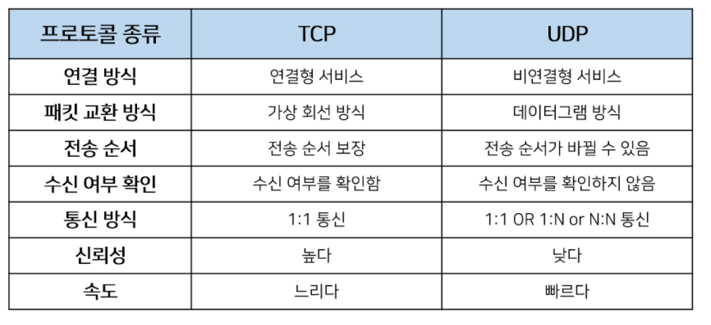

자바에서는 `java.net` 패키지를 통해
네트워킹과 관련된 클래스들을 제공한다.

## InetAddress

IP 주소를 다루기 위한 클래스.

[InetAddress (Java Platform SE 8) - Oracle](https://docs.oracle.com/javase/8/docs/api/java/net/InetAddress.html)

```java
import java.net.InetAddress;
import java.net.UnknownHostException;

class Playground {
  public static void main(String[] args) {
    try {
      InetAddress ip = InetAddress.getByName("www.google.com");
      System.out.println("getHostName() : " + ip.getHostName());
      System.out.println("getHostAddress() : " + ip.getHostAddress());
      System.out.println("toString() : " + ip.toString());
    } catch (UnknownHostException e) {
      e.printStackTrace();
    }
  }
}
```

## URL

URL을 다루기 위한 클래스.

[URL (Java Platform SE 8) - Oracle](https://docs.oracle.com/javase/8/docs/api/java/net/URL.html)

```java
import java.net.MalformedURLException;
import java.net.URL;

class Playground {
  public static void main(String[] args) {
    try {
      URL url = new URL("https://www.google.com/preferences");
      System.out.println("Protocol : " + url.getProtocol());
      System.out.println("Host : " + url.getHost());
      System.out.println("Path : " + url.getPath());
    } catch (MalformedURLException e) {
      e.printStackTrace();
    }
  }
}
```

## URLConnection

어플리케이션과 URL간의 연결을 나타내는 클래스의
최상위 클래스. 추상 클래스이다.

[URLConnection (Java Platform SE 8) - Oracle](https://docs.oracle.com/javase/8/docs/api/java/net/URLConnection.html)

```java
import java.io.BufferedReader;
import java.io.IOException;
import java.io.InputStreamReader;
import java.net.URL;

class Playground {
  public static void main(String[] args) {
    URL url = null;
    BufferedReader input = null;
    String address = "http://info.cern.ch/hypertext/WWW/TheProject.html";
    String line = "";

    try {
      url = new URL(address);
      input = new BufferedReader(new InputStreamReader(url.openStream()));

      while ((line = input.readLine()) != null) {
        System.out.println(line);
      }

      input.close();
    } catch (IOException e) {
      e.printStackTrace();
    }
  }
}
```

## 소켓 프로그래밍

소켓을 이용한 통신 프로그래밍,
전송 방식에 따라 TCP 또는 UDP로 나뉜다.



### TCP 소켓 프로그래밍

ServerSocket과 Socket 클래스를 사용하며,
다음과 같은 절차로 진행된다.

1. 서버 소켓을 생성한다. (ServerSocket 클래스)
2. 서버 소켓은 클라이언트 소켓의 연결 요청을 기다린다.
3. 클라이언트 소켓은 서버 소켓에게 연결을 요청한다. (Socket 클래스)
4. 클라이언트 소켓의 연결 요청을 받은 서버 소켓은 새로운 소켓을 생성해
   클라이언트 소켓과 연결한다.
5. 이후 스트림을 통해 일대일 통신한다.

서버에서는 여러 개의 쓰레드를 생성해
클라이언트의 요청을 처리하기도 한다.
접속하는 클라이언트의 수가 많을 때는
멀티쓰레딩을 통해 병렬적으로 처리하는 것이 좋다.

### UDP 소켓 프로그래밍

DatagramSocket과 DatagramPacket 클래스를 사용한다.

## Reference

- 남궁성, Java의 정석 (3rd Edition), 도우출판
- [InetAddress (Java Platform SE 8) - Oracle](https://docs.oracle.com/javase/8/docs/api/java/net/InetAddress.html)
- [URL (Java Platform SE 8) - Oracle](https://docs.oracle.com/javase/8/docs/api/java/net/URL.html)
- [URLConnection (Java Platform SE 8) - Oracle](https://docs.oracle.com/javase/8/docs/api/java/net/URLConnection.html)
