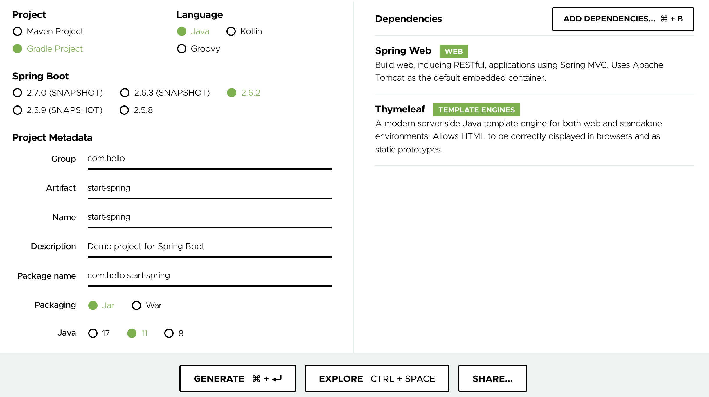
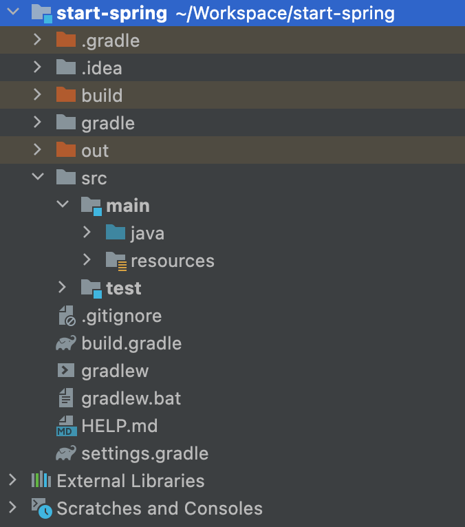
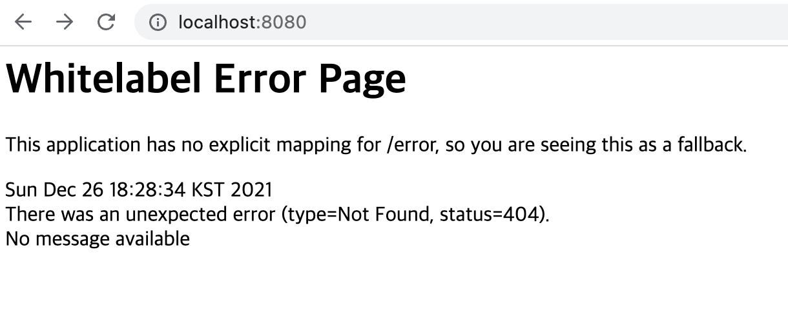
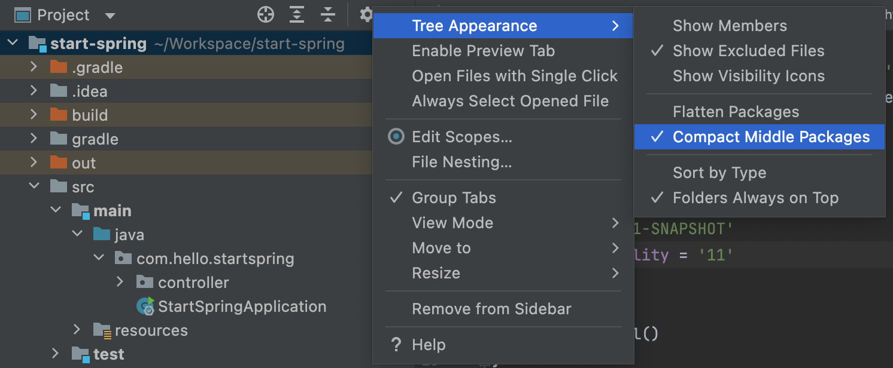
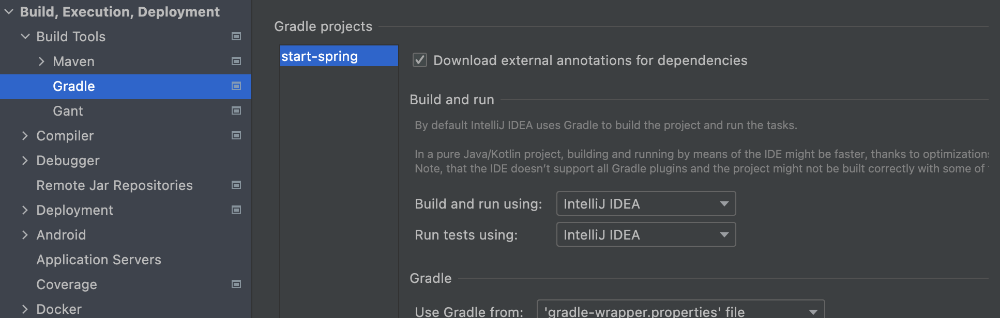

  https://spring.io/

김영한님의 ['스프링 입문 - 코드로 배우는 스프링 부트, 웹 MVC, DB 접근 기술'](https://www.inflearn.com/course/%EC%8A%A4%ED%94%84%EB%A7%81-%EC%9E%85%EB%AC%B8-%EC%8A%A4%ED%94%84%EB%A7%81%EB%B6%80%ED%8A%B8)
인프런 강의를 들으며 공부하는 내용들을 간단히 정리한다.

Spring 프레임워크를 자세히 공부하기보다는,
이후의 '스프링 기본편' 강의를 듣기 전에
간단히 프로젝트를 만들어보며 입문하는 것에
목적이 있다.

## 개발 환경 세팅

### 1. IDE 설치

일반적으로 IntelliJ와 Eclipse를 사용하는데,
최근에는 IntelliJ를 많이 사용한다고 한다.
편리한 기능이 굉장히 많다고..

### 2. JDK 설치

기존에는 JDK 8을 사용했지만,
강의에서 권장하는 JDK 11을 설치했다.

## 프로젝트 생성

[Spring Initializr](https://start.spring.io/)를
사용해서 빠르게 프로젝트를 생성할 수 있다.

- Project : Gradle과 Maven이 빌드와 의존성 관리 등을 담당하는 것 같다.
  Gradle을 사용하기로.
- Language : Java
- Spring Boot : Spring Boot의 버전을 선택한다.
  SNAPSHOT 버전을 제외한 최신 버전을 선택했다.
- Project Metadata : 프로젝트의 그룹명과 이름 등을 설정한다.
  자바 버전은 11을 사용하도록 설정한다.
- Dependencies : 의존성을 추가할 수 있다. Spring Web과
  Thymeleaf을 추가한다. Thymeleaf는 템플릿 엔진이라고 한다.

하단의 GENERATE를 통해 프로젝트를 다운로드하고 IntelliJ에서 Open한다.
처음 프로젝트를 열면 잠시동안 의존성 라이브러리가 다운로드된다.

## 프로젝트 구조

|                |                                                                                    |
| -------------- | ---------------------------------------------------------------------------------- |
| `.idea`        | IntelliJ 설정 폴더                                                                 |
| `gradle`       | gradle 관련 폴더                                                                   |
| `src/main`     | `java`와 `resources` 폴더가 존재하며, `java` 폴더에 패키지와 소스 코드들이 위치함. |
| `src/test`     | 테스트 코드                                                                        |
| `build.gradle` | Gradle 관련 설정 파일. Spring Initializr에 의해 이미 작성되어 있음.                |

## 프로젝트 실행

1. `/src/main/java/com.hello.startspring/StartSpringApplication`에 위치한
   기본 메인 클래스를 실행한다.
2. [localhost:8080](http://localhost:8080) 접속
3. Whitelabel Error Page가 출력되면 성공!

## 기타 설정

### Project 탭 패키지 표시 방식 변경

[Project 탭의 설정 아이콘] > [Tree Appearance] > [Compact Middle Packages] 설정을 통해
패키지 구조를 다르게 띄울 수 있다. (패키지 이름을 나누지 않고 한번에 보여줄 것인지의 여부)

### 프로젝트 실행 방식 변경

프로젝트를 Gradle로 실행하는 것이 기본 설정인데,
자바로 직접 실행하는 것보다 느리다고 한다.

[Preferences] > [Build, Execution, Deployment] > [Build Tools] > [Gradle]
에서 [Build and run using]과 [Run tests using] 항목을 IntelliJ IDEA로 설정한다.

## Reference

- [김영한, 스프링 입문 - 코드로 배우는 스프링 부트, 웹 MVC, DB 접근 기술](https://www.inflearn.com/course/%EC%8A%A4%ED%94%84%EB%A7%81-%EC%9E%85%EB%AC%B8-%EC%8A%A4%ED%94%84%EB%A7%81%EB%B6%80%ED%8A%B8)
