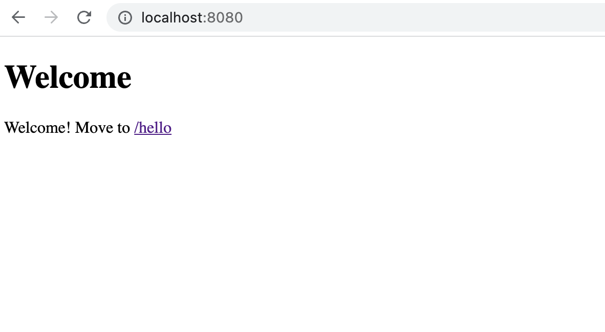
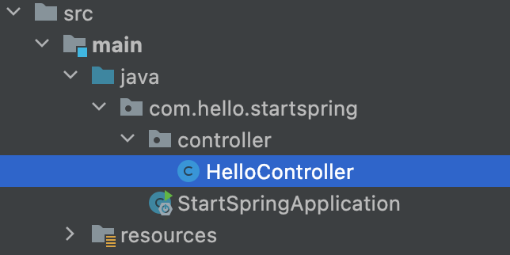
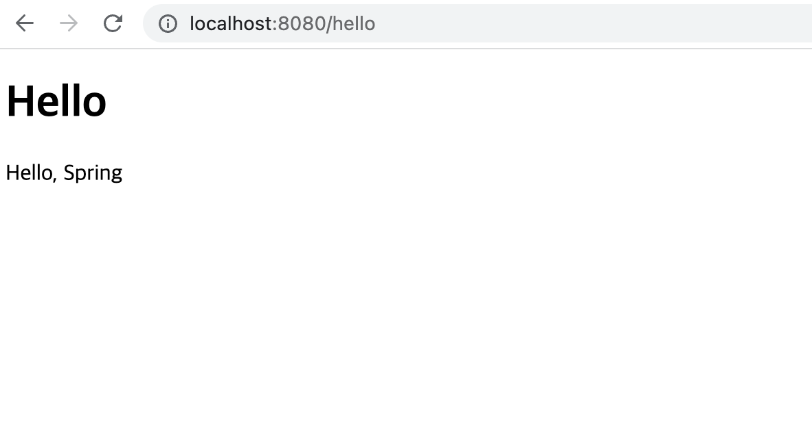

## Welcome 페이지 추가하기

`src/main/resources/static` 경로에
`index.html` 파일을 생성하고 다음 내용을 입력한다.

```html
<!DOCTYPE html>
<html lang="en">
  <head>
    <meta charset="UTF-8" />
    <title>Welcome</title>
  </head>
  <body>
    <h1>Welcome</h1>
    <p>Welcome! Move to <a href="/hello">/hello</a></p>
  </body>
</html>
```

스프링 부트는 `index.html` 정적 페이지를 먼저 찾고,
없으면 `index` 템플릿을 찾아 Welcome 페이지로 사용한다고
[공식 문서](https://docs.spring.io/spring-boot/docs/2.3.1.RELEASE/reference/html/spring-boot-features.html#boot-features-spring-mvc-welcome-page)에서 언급하고 있다.

[localhost:8080](http://localhost:8080)으로
접속하면 Welcome 페이지를 확인할 수 있다.



## Thymeleaf 템플릿 엔진

정적 페이지가 아니라
Thymeleaf 템플릿 엔진을 사용해 페이지를 제공할 수도 있다.

`/hello` 경로로 접근시 제공할 페이지를 작성하려고 한다.
`com.hello.startspring.controller` 패키지를 생성하고,
그 안에 `HelloController` 클래스를 추가한다.



`HelloController` 클래스에 다음과 같은 코드를 작성한다.

```java
package com.hello.startspring.controller;

import org.springframework.stereotype.Controller;
import org.springframework.ui.Model;
import org.springframework.web.bind.annotation.GetMapping;

@Controller
public class HelloController {

  @GetMapping("hello")
  public String hello(Model model) {
    model.addAttribute("user", "Spring");
    return "hello";
  }
}
```

- `HelloController` 클래스 위에 `@Controller`
- `@GetMapping("hello")`는 `/hello`라는 경로에 대해
  해당 메서드(hello)를 매핑한다는 의미이다.
  Get은 HTTP 메서드의 그 Get 맞다.
- hello() 메서드는 Model을 인자로 받아 `user`라는 이름에
  `Spring`이라는 속성을 추가하고, 문자열 `"hello"`를 반환한다.

hello() 메서드가 문자열 `"hello"`를 반환함으로써
`hello`라는 이름을 가진 템플릿을 사용하게 된다.
`src/main/resources/templates` 경로에
`hello.html` 파일을 생성하고 다음 내용을 입력한다.

```html
<!DOCTYPE html>
<html xmlns:th="http://www.thymeleaf.org">
  <head>
    <meta charset="UTF-8" />
    <title>Hello</title>
  </head>
  <body>
    <h1>Hello</h1>
    <p th:text="'Hello, ' + ${user}">Hello, Guest.</p>
  </body>
</html>
```

[localhost:8080/hello](http://localhost:8080/hello)
에 접속해보니 이런 페이지를 출력한다.



컨트롤러에서 `addAttribute()`를 통해 추가했던 이름-값 속성이
템플릿 엔진에 의해 적용되었음을 알 수 있다.

## Reference

- [김영한, 스프링 입문 - 코드로 배우는 스프링 부트, 웹 MVC, DB 접근 기술](https://www.inflearn.com/course/%EC%8A%A4%ED%94%84%EB%A7%81-%EC%9E%85%EB%AC%B8-%EC%8A%A4%ED%94%84%EB%A7%81%EB%B6%80%ED%8A%B8)
- [Spring Boot Features - Spring](https://docs.spring.io/spring-boot/docs/2.3.1.RELEASE/reference/html/spring-boot-features.html)
