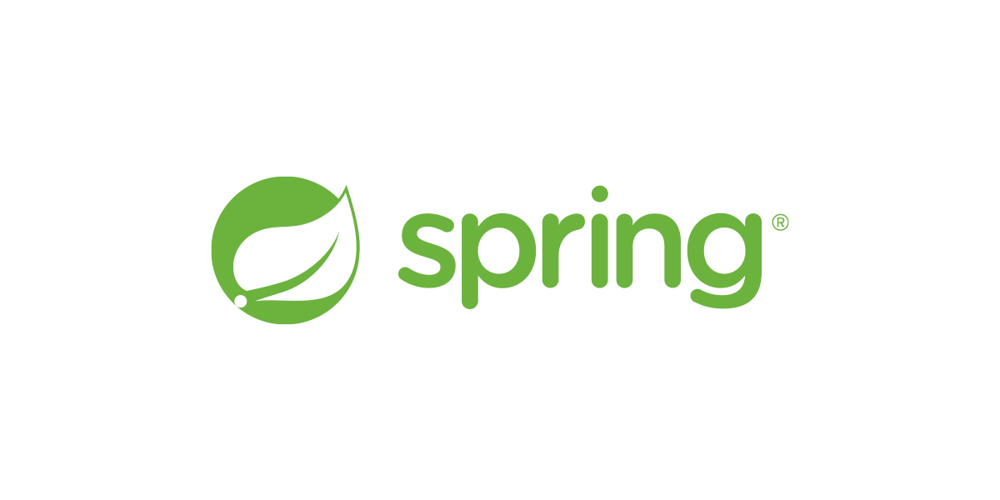

<p align="center" style="color: #888888; font-size: 12px;">
  https://spring.io/
</p>

## 1. Bean 스코프

- Bean이 언제부터 언제까지 존재할 수 있는가
- 싱글톤 : 기본 설정, 스프링 컨테이너의 시작부터 끝까지
- 프로토타입 : Bean 조회시 생성하고 컨테이너에서는 보관하지 않음
- 웹 관련 스코프 : 웹 환경에서만 동작
  - request : 요청이 들어오고 응답이 나갈 때까지
  - session : 웹 세션의 생성부터 종료까지
  - application : 서블릿 컨텍스트와 같은 범위
  - websocket : 웹 소켓과 같은 범위
- `@Scope` 어노테이션을 통해 설정

## 2. 프로토타입 스코프

- 생성 시점 : `getBean()`과 같은 Bean의 조회시 생성
- 소멸 시점 : 애초에 컨테이너가 보관하지 않기 때문에 컨테이너가 소멸시키지 않고, 객체를 제공받은 클라이언트 코드가 직접 소멸시킴
- Bean을 조회할때마다 생성되므로, 항상 다른 인스턴스가 반환됨
- 프로토타입 Bean에 대한 컨테이너의 책임은 생성과 의존성 주입, 초기화까지

```java
// 프로토타입 Bean
@Scope("prototype")
public class PrototypeBean {}
```

## 3. 프로토타입 Bean을 의존하는 싱글톤 Bean의 문제

### 문제 상황

- 싱글톤 Bean이 프로토타입 Bean을 의존하는 경우, 프로토타입 Bean을 프로토타입처럼 쓰지 못할 수 있음
- 싱글톤 Bean은 주입받은 프로토타입 Bean을 내부 필드에 저장하여 참조
- 특정 로직 실행시마다 프로토타입 Bean을 새로 받아 쓰는게 아니라, 내부 필드에서 참조하고 있는 프로토타입 Bean을 계속 사용하게 됨

```java
// 싱글톤 Bean
public class SingletonBean {
  private final PrototypeBean prototypeBean;

  @Autowired
  public SingletonBean(PrototypeBean prototypeBean) {
    this.prototypeBean = prototypeBean;
  }

  // 프로토타입 Bean의 주소를 출력하겠음
  public void logic() {
    System.out.println("logic() : " + prototypeBean);
  }
}
```

```java
// 싱글톤 Bean과 프로토타입 Bean을 컨테이너에 등록
ApplicationContext ac = new AnnotationConfigApplicationContext(SingletonBean.class, PrototypeBean.class);

// 싱글톤 Bean 조회
SingletonBean singletonBean = ac.getBean(SingletonBean.class);

// 프로토타입 Bean을 사용하는 특정 로직 실행
singletonBean.logic();
singletonBean.logic();
```

```
[출력]
logic() : hello.core.scope.PrototypeBean@5bf8fa12
logic() : hello.core.scope.PrototypeBean@5bf8fa12
```

### ObjectProvider를 통한 해결

- ObjectProvider는 지정한 타입의 Bean을 컨테이너에서 조회하는 Dependency Lookup 기능을 제공
- SingletonBean이 PrototypeBean을 주입받는 대신에 DL을 통해 PrototypeBean을 조회
- `getObject()` 실행시마다 조회가 발생하므로 새 프로토타입 Bean이 반환됨

```java
public class SingletonBean {
  private final ObjectProvider<PrototypeBean> prototypeBeanProvider;

  @Autowired
  public SingletonBean(ObjectProvider<PrototypeBean> prototypeBeanProvider) {
    this.prototypeBeanProvider = prototypeBeanProvider;
  }

  public void logic() {
    System.out.println("logic() : " + prototypeBeanProvider.getObject());
  }
}
```

```
[출력]
logic() : hello.core.scope.PrototypeBean@12f9af83
logic() : hello.core.scope.PrototypeBean@7e6ef134
```

### Provider를 통한 해결

- ObjectProvider와 마찬가지로 DL 기능 제공
- `get()` 메서드 하나만을 제공하여 ObjectProvider보다는 기능이 단순함
- JSR 표준으로 Spring 외 컨테이너에서도 사용 가능
- `javax.inject:javax.inject:1` 라이브러리 필요

```java
public class SingletonBean {
  private final Provider<PrototypeBean> prototypeBeanProvider;

  @Autowired
  public SingletonBean(Provider<PrototypeBean> prototypeBeanProvider) {
    this.prototypeBeanProvider = prototypeBeanProvider;
  }

  public void logic() {
    System.out.println("logic() : " + prototypeBeanProvider.get());
  }
}
```

```
[출력]
logic() : hello.core.scope.PrototypeBean@41709512
logic() : hello.core.scope.PrototypeBean@33308786
```

## 4. request 스코프

- 웹 스코프 중 하나로서 웹 환경에서만 동작
  - `org.springframework.boot:spring-boot-starter-web` 라이브러리 필요
- HTTP 요청이 들어오면 Bean 생성
- 요청 처리 후에 Bean 소멸
- Bean의 생성부터 소멸까지 컨테이너에서 관리

```java
@Component
@Scope("request")
public class RequestScopeBean {}
```

## 5. request 스코프의 Bean 의존시의 문제

### 문제 상황

- request 스코프 Bean을 의존하는 경우
- 아래 코드는 예외가 발생하여 실행이 불가능
- request 스코프는 생성 시점이 요청을 받았을때이므로, 다른 Bean에서 의존성 주입을 받으려고 할때 컨테이너에 존재하지 않음

```java
@Controller
public class HelloController {
  private RequestScopeBean requestScopeBean;

  // 의존성 주입 시점에 RequestScopeBean이 컨테이너에 있을까? NO!
  @Autowired
  public HelloController(RequestScopeBean requestScopeBean) {
    this.requestScopeBean = requestScopeBean;
  }

  @GetMapping("hello")
  @ResponseBody
  public String hello() {
    System.out.println("requestScopeBean = " + requestScopeBean);
    return "OK";
  }
}
```

### 해결: ObjectProvider

- ObjectProvider 또는 Provider
- DI 대신 DL하여 해결
- 요청이 들어오고나서 Bean을 조회하므로 정상 작동

```java
@Controller
public class HelloController {
  private ObjectProvider<RequestScopeBean> requestScopeBeanProvider;

  @Autowired
  public HelloController(ObjectProvider<RequestScopeBean> requestScopeBeanProvider) {
    this.requestScopeBeanProvider = requestScopeBeanProvider;
  }

  @GetMapping("hello")
  @ResponseBody
  public String hello() {
    System.out.println("requestScopeBean = " + requestScopeBeanProvider.getObject());
    return "OK";
  }
}
```

### 해결: 프록시

- `@Scope`에서 `proxyMode`를 설정하는 것만으로 해결 가능
- 의존성 주입시 request 스코프 Bean에 대한 가짜 프록시 객체를 만들어 주입해두고, 컨테이너에도 등록함
- 실제 요청이 오면 가짜 프록시 객체의 메서드에서 실제 Bean의 메서드를 호출
- CGLIB을 통한 바이트 코드 단위의 조작으로 구현됨

```java
@Component
@Scope(value = "request", proxyMode = ScopedProxyMode.TARGET_CLASS)
public class RequestScopeBean {}
```

## Reference

- [김영한, 스프링 핵심 원리 - 기본편](https://www.inflearn.com/course/%EC%8A%A4%ED%94%84%EB%A7%81-%ED%95%B5%EC%8B%AC-%EC%9B%90%EB%A6%AC-%EA%B8%B0%EB%B3%B8%ED%8E%B8)
