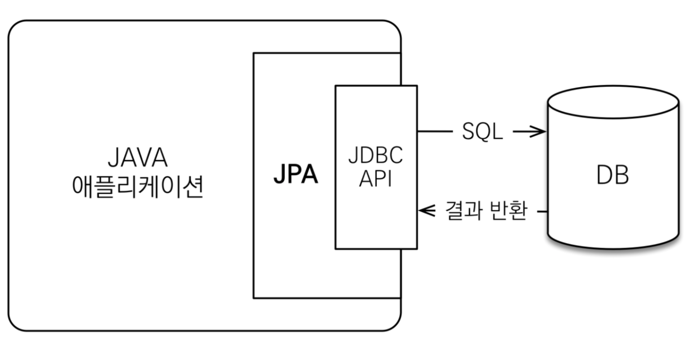

## 1. JPA란

  https://kangwoojin.github.io/programing/JPA-%EC%86%8C%EA%B0%9C/

- Java Persistence API
- Java 진영의 ORM 표준 인터페이스
  - Object-relational mapping
  - OOP의 객체와 RDBMS의 테이블을 매핑하는 기술
- 프로그래머 입장에서는 객체로서 데이터를 CRUD
  - SQL 중심적인 개발에서 객체 중심의 개발로

## 2. JPA의 장점

- 생산성
  - SQL을 작성하는 것보다 훨씬 간단한 CRUD
- 유지보수
  - 요구 사항이 바뀌어도 코드 변경이 적음
  - 예를 들어, 새로운 필드 추가시 모든 SQL 쿼리문을 수정할 필요 없이 JPA Entity에 필드 하나만 추가
- 패러다임의 불일치를 해결
  - 그동안 객체 지향으로 개발하면서 관계형 데이터베이스를 사용
  - JPA를 통해 객체 지향만 고려하며 개발, 데이터베이스는 JPA가 알아서 처리
  - 예를 들어, 상속 관계의 객체는 JPA가 슈퍼/서브타입으로 나누고 조회시 조인해서 데이터를 가져옴
- 성능 최적화
  - 1차 캐시를 통해 같은 트랜잭션 안에서는 같은 엔티티를 반환
  - DB의 Isolation level이 Read Commit이어도 애플리케이션에서 Repeatable Read되도록 보장
  - 트랜잭션 안에서의 쓰기 지연을 통해 쿼리를 한번에 모아 보내고 락 시간을 최소화
  - 지연 로딩을 통해 객체가 실제 사용될때 로딩

## 3. Hibernate

  https://hibernate.org/

- JPA는 인터페이스, Hibernate는 그 구현체
  - Hibernate가 먼저 나왔고, Java 진영에서 이를 추상화하여 표준에 포함한 것이 JPA
- EJB를 대체하기 위해 Gavin King 등에 의해 2001년 릴리즈

## 4. 기타 키워드

- Spring Data JPA
  - JPA를 한 단계 더 추상화하여 Spring에서 더 쉽고 편하게 사용할 수 있도록 제공되는 모듈
- Persistence (영속성)
  - 데이터를 생성한 프로세스가 종료되어도 데이터가 사라지지 않는 특성
  - 영속성 컨텍스트를 통해 Entity를 영구 저장

## Reference

- [김영한, 자바 ORM 표준 JPA 프로그래밍 - 기본편](https://www.inflearn.com/course/ORM-JPA-Basic)
- [Hibernate (framework) - Wikipedia](<https://en.wikipedia.org/wiki/Hibernate_(framework)>)
- [JPA, Hibernate, 그리고 Spring Data JPA의 차이점 - suhwan.dev](https://suhwan.dev/2019/02/24/jpa-vs-hibernate-vs-spring-data-jpa/)
