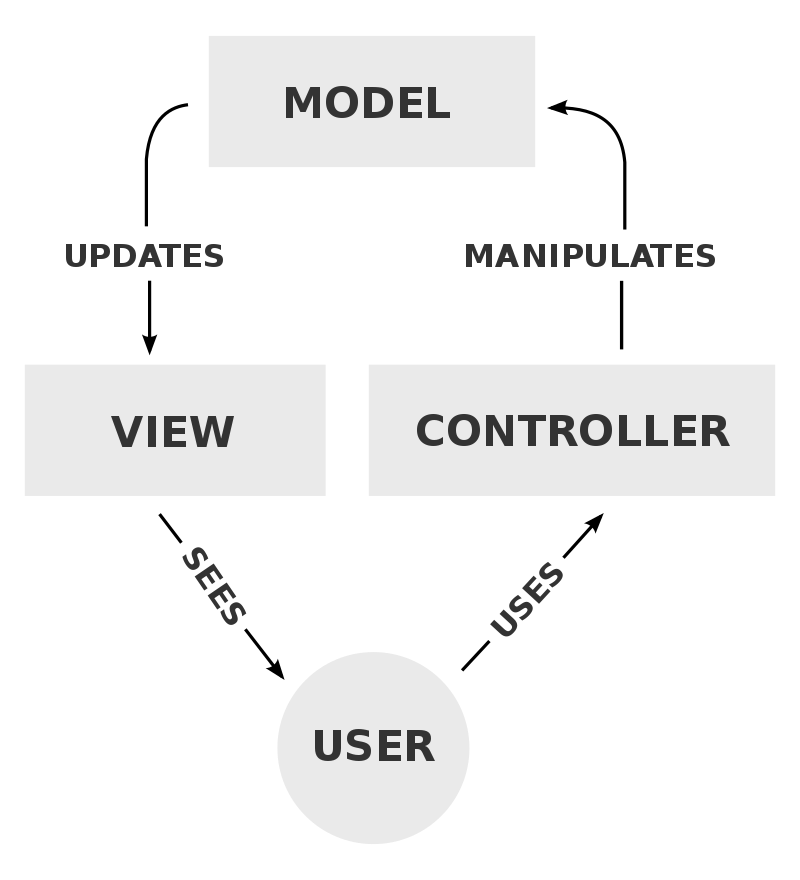
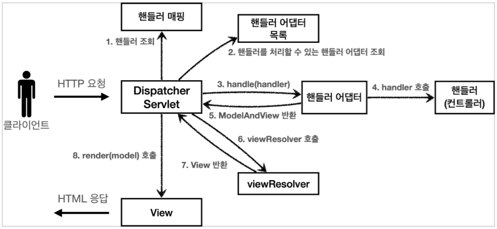

## MVC 패턴

### MVC 패턴이란

MVC(Model-View-Controller) 패턴은 소프트웨어 디자인 패턴의 일종입니다.
화면과 비즈니스 로직이라는 두 관심사를 분리하는데 중점을 두고 있습니다.
MVC 패턴을 이루는 세 가지 요소는 다음과 같습니다.

  https://en.wikipedia.org/wiki/Model%E2%80%93view%E2%80%93controller

- 모델 : 데이터를 담아 두는 것에 집중합니다.
- 뷰 : 화면을 그리는 것에 집중합니다.
- 컨트롤러 : HTTP 요청을 받아 파라미터를 검증하고, 비즈니스 로직을 처리합니다. 그리고 데이터를 조회하고 모델에 담아 뷰에 전달합니다.

> **컨트롤러와 서비스의 분리**
>
> 비즈니스 로직을 Controller에서 처리하도록 하면 Controller가 하는 일이 너무 많을 수 있습니다. 그래서 Service 계층을 만들어 비즈니스 로직을 처리하도록 하는 경우가 많습니다. Controller는 직접 비즈니스 로직을 처리하지 않고 Service를 호출합니다.

### MVC 패턴이 해결하는 문제

전에 학교 수업에서 JSP로 간단한 웹 메모 서비스를 개발했던 것이 기억나 소스 코드를 읽어보았습니다. 분량이 너무 많아 이곳에 소스 코드를 올리긴 어려운데, 감상을 요약하자면 **길고 복잡한 스파게티 코드!** 정도로 표현할 수 있을 것 같습니다.

메모 조회하는 페이지를 구현하기 위해, 메모 데이터를 가져오는 비즈니스 로직과 화면을 구성하는 HTML 문서를 하나의 파일에 작성했습니다. 상이한 역할을 하는 두 소스 코드를 결합하는 것은 소프트웨어의 유지 보수를 어렵게 만드는 원인 중 하나입니다. 특히 비즈니스 로직과 화면은 내용이 수정되는 라이프 사이클도 다를 가능성이 높습니다.

상기한 것처럼, MVC 패턴은 **화면과 비즈니스 로직이라는 두 관심사를 분리합니다.** 만약 제가 웹 메모 서비스 개발에 MVC 패턴을 적용했다면, 소스 코드를 읽고 수정하는 모든 업무를 훨씬 간단하게 처리할 수 있었을 것입니다.

## Spring MVC

### Spring MVC의 구조

  김영한, 스프링 MVC 1편 - 백엔드 웹 개발 핵심 기술

많은 요소로 구성되어 있는데, 김영한님의 [Spring MVC 1편](https://www.inflearn.com/course/%EC%8A%A4%ED%94%84%EB%A7%81-mvc-1) 강의에서 '섹션 4. MVC 프레임워크 만들기' 부분을 먼저 공부하면 이해에 많은 도움이 될 것 같습니다.

위에서 소개한 MVC 패턴의 구조와 비교하면 전혀 다르다고 생각할 수 있지만, 더 나은 구조를 위해 프론트 컨트롤러와 어댑터 같은 여러 디자인 패턴이 적용되었을 뿐 모델, 뷰, 컨트롤러라는 뿌리는 같습니다.

### Spring MVC의 동작 흐름

#### 0. HTTP 요청

클라이언트에서 HTTP 요청을 보내면 DispatcherServlet에서 받게 됩니다. 왜냐하면 DispatcherServlet은 모든 URL 경로와 매칭되어 실행되는 HttpServlet이기 때문입니다.

DispatcherServlet과 같은 컨트롤러를 **프론트 컨트롤러**라고 합니다. 가장 앞단에 배치되어 클라이언트가 보내는 모든 요청을 받고, 요청 URL에 따라 적절한 컨트롤러를 매칭해 실행하는 역할을 합니다. 그동안 수많은 컨트롤러에서 공통적으로 처리해야 했던 일들을 프론트 컨트롤러에서 한번에 처리할 수 있고, 다른 컨트롤러들은 더 이상 서블릿에 대해 생각하지 않아도 됩니다.

DispatcherServlet은 아래 1번부터 8번까지의 동작을 수행합니다.

#### 1. 핸들러 조회

클라이언트에서 요청한 URL에 따라 미리 매핑되어 있는 핸들러를 조회합니다. 여기서 핸들러란 요청에 대한 핸들러, 즉 컨트롤러입니다.

핸들러를 매핑하는 방법은 HandlerMapping이라는 인터페이스 아래 이미 구현이 되어 있으며, 스프링 부트에서 아래 핸들러 매핑을 자동 등록하므로 따로 구현할 필요는 없습니다.

- RequestMappingHandlerMapping : 애노테이션 기반 컨트롤러인 @RequestMapping에서 사용
- BeanNameUrlHandlerMapping : 스프링 빈의 이름으로 핸들러 매핑

#### 2. 핸들러 어댑터 조회

앞에서 핸들러를 조회했으니, 해당 핸들러를 실행할 수 있는 핸들러 어댑터를 조회합니다. 핸들러 어댑터는 핸들러에 어댑터 패턴을 적용한 것인데, 덕분에 서로 다른 인터페이스의 핸들러를 실행할 수 있습니다.

> **어댑터 패턴**
>
> 110v와 220v의 전기 콘센트가 있다고 합시다. 110v 규격의 휴대폰 충전기를 사용해야 하는데, 220v 전기 콘센트밖에 없다면? 중간에 변환 어댑터를 끼워야 합니다. 어댑터 패턴은 인터페이스가 달라도 호환성을 제공하기 위한 방법이며, 자세한 내용은 [외부 자료](https://jusungpark.tistory.com/22)를 참고해주세요.

위 핸들러 매핑처럼, 핸들러 어댑터 또한 HandlerAdapter 인터페이스 아래 좋은 구현체들이 존재합니다.

- RequestMappingHandlerAdapter : 애노테이션 기반 컨트롤러인 @RequestMapping에서 사용
- HttpRequestHandlerAdapter : HttpRequestHandler 처리
- SimpleControllerHandlerAdapter : Controller 인터페이스 처리 (`@Controller`가 아닌, 지금은 잘 사용하지 않는 `Controller` 인터페이스입니다.)

#### 3. 핸들러 어댑터 실행

조회한 핸들러 어댑터를 실행합니다.

#### 4. 핸들러 실행

핸들러 어댑터를 통해 핸들러를 실행합니다.

#### 5. ModelAndView 반환

핸들러 어댑터는 핸들러가 반환한 정보를 ModelAndView 객체로 반환합니다. ModelAndView 객체에는 응답하고자 하는 뷰의 이름과 뷰에 전달할 값이 담겨 있습니다.

#### 6. ViewResolver 호출

뷰 리졸버를 실행합니다. 뷰 리졸버는 ModelAndView에 저장된 논리적인 뷰의 이름을 받아 물리적인 뷰를 반환하는 역할을 합니다.

쉽게 말하면, 핸들러가 `index 페이지를 띄우고 싶어`라며 ModelAndView에 `index`라는 값을 담아 반환합니다. 이를 받은 DispatcherServlet이 `index`라는 값을 꺼내 뷰 리졸버에게 전달하면, 뷰 리졸버는 실제 서버 리소스에 존재하는 `index.html`의 뷰를 반환하는 것입니다.

#### 7. View 반환

뷰 리졸버가 뷰 객체를 반환합니다.

#### 8. 뷰 렌더링

뷰 객체를 통해 뷰를 렌더링합니다.

## Reference

- [김영한, 스프링 MVC 1편 - 백엔드 웹 개발 핵심 기술](https://www.inflearn.com/course/%EC%8A%A4%ED%94%84%EB%A7%81-mvc-1)
- [MVC - MDN](https://developer.mozilla.org/ko/docs/Glossary/MVC)
- [[스프링 - MVC] MVC 구조에 대한 이해 - 매코매개](https://taegyunwoo.github.io/spring-mvc/SPRING_MVC_Structure)
