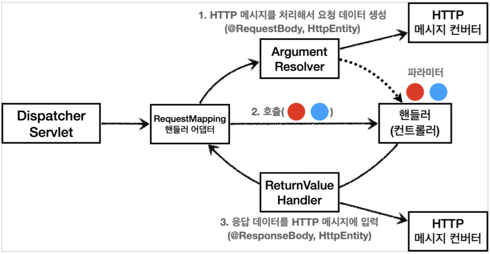

## HTTP 메시지 컨버터

- HTTP API처럼 JSON 데이터를 HTTP 바디에서 읽고 쓰는 경우, HTTP 메시지 컨버터를 사용하는 것이 편리
- HTTP 요청의 경우, `@RequestBody`와 `HttpEntity`(`RequestEntity`)일때 메시지 컨버터가 사용됨
- HTTP 응답의 경우, `@ResponseBody`와 `HttpEntity`(`ResponseEntity`)일때 메시지 컨버터가 사용됨

## HttpMessageConverter 인터페이스와 구현체

```java
package org.springframework.http.converter;

public interface HttpMessageConverter<T> {

	boolean canRead(Class<?> clazz, @Nullable MediaType mediaType);

	boolean canWrite(Class<?> clazz, @Nullable MediaType mediaType);

	List<MediaType> getSupportedMediaTypes();

	T read(Class<? extends T> clazz, HttpInputMessage inputMessage)
			throws IOException, HttpMessageNotReadableException;

	void write(T t, @Nullable MediaType contentType, HttpOutputMessage outputMessage)
			throws IOException, HttpMessageNotWritableException;
}
```

Spring Boot에서 사용하는 기본 메시지 컨버터는 다음과 같다.

- ByteArrayHttpMessageConverter : byte[] 데이터를 처리한다.
- StringHttpMessageConverter : String 문자로 데이터를 처리한다.
- MappingJackson2HttpMessageConverter : application/json

## HTTP 요청과 응답에서의 동작 흐름

### HTTP 요청

1. HTTP 요청이 오고, 컨트롤러에서 `@RequestBody`, `HttpEntity` 파라미터를 사용한다.
2. 메시지 컨버터가 메시지를 읽을 수 있는지 확인하기 위해 `canRead()`를 호출한다.
   - 대상 클래스 타입을 지원하는지
   - 해당 Content-Type 미디어 타입을 지원하는지
3. `canRead()` 조건을 만족하는 경우 `read()`를 호출해 객체를 생성하고 반환한다.

### HTTP 응답

1. 컨트롤러에서 `@ResponseBody`, `HttpEntity`로 값이 반환된다.
2. 메시지 컨버터가 메시지륻 쓸 수 있는지 확인하기 위해 `canWrite()`를 호출한다.
   - 대상 클래스 타입을 지원하는지
   - 해당 Content-Type 미디어 타입을 지원하는지
3. `canWrite()` 조건을 만족하면 `write()`를 호출해 HTTP 응답 메시지 바디에 데이터를 생성한다.

## ArgumentResolver와 ReturnValueHandler



### ArgumentResolver

핸들러를 작성하다보면 메서드의 파라미터를 굉장히 다양하게 구성할 수 있다.
필요한 값이 있으면 파라미터로 추가해 받아올 수 있도록 유연성을 제공한다.

이런 부분을 ArgumentResolver가 담당한다.
`@RequestMapping`의 핸들러 어댑터인 `RequestMappingHandlerAdapter`가
`ArgumentResolver`를 호출해 핸들러가 필요로 하는 다양한 파라미터의 객체를 생성한다.

```java
public interface HandlerMethodArgumentResolver {

    boolean supportsParameter(MethodParameter parameter);

	@Nullable
    Object resolveArgument(MethodParameter parameter,
		@Nullable ModelAndViewContainer mavContainer,
        NativeWebRequest webRequest,
		@Nullable WebDataBinderFactory binderFactory) throws Exception;
}
```

ArgumentResolver는 `supprtsParameter()`를 호출해 해당 파라미터를 지원하는지 확인하고,
`resolveArgument()`를 호출해 실제 객체를 생성한다.

### ReturnValueHandler

ReturnValueHandler는 핸들러의 반환 타입에 유연성을 제공한다.
컨트롤러에서 뷰 이름을 반환해도 뷰를 띄울 수 있는 이유가 ReturnValueHandler 때문이다.

## Reference

- [김영한, 스프링 MVC 1편 - 백엔드 웹 개발 핵심 기술](https://www.inflearn.com/course/%EC%8A%A4%ED%94%84%EB%A7%81-mvc-1)
