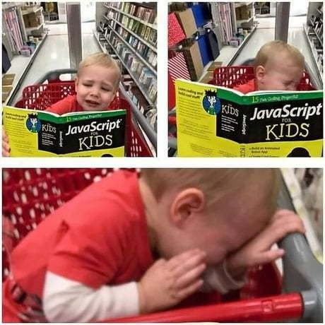
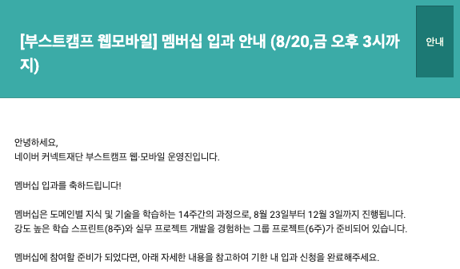

부스트캠프 챌린지 과정이 끝나고 일주일이 후다닥 지나갔다.

지난 4주의 챌린지 과정은 나로서는 드물게도 한 가지에 매우 열중해있었던 시간이고,
스스로 발전했다고 느끼는 부분도 있는가 하면 아직 부족하다고 느끼는 부분도 많다.

내가 부스트캠프 챌린지에서 얻은 것은 무엇이며 얻지 못한 것은 무엇인가 생각해보고,
원래의 방학 일정엔 없었던 이 특별한 경험을 기록해두고 싶어서 이렇게 블로그까지 만들어 글을 작성해보았다.

멤버십 과정 끝나고 읽어보면 재밌을 것 같아서..

## 부스트캠프 챌린지에서 경험한 새로운 학습 방식

챌린지 과정은 매일 주어지는 어려운 문제들을 해결해가는 작업의 연속인데,
특별하다고 생각한 점은 다음과 같다.

- 평소에는 생각해보지도 못했던 문제들

`아니 어떻게 이런 문제를 낼 생각을 하셨지?` 혹은 `이걸 구현하라구요...?` 와 같은 생각이 드는 미션이 자주 있었지만...
`오히려 좋아!`

- 같은 문제에 대해 고민하는 300여명 규모의 커뮤니티

같은 시각에 같은 문제에 대해 고민하는 사람이 300명씩 모이는 것은 흔치 않은 경험이다.
문제에 대한 토의가 굉장히 활발하고 적극적으로 이루어졌으며, 수많은 정보를 교환했다.

- 매일 동료들과 코드와 공부한 내용을 공유

부스트캠프는 '함께' 성장하는 경험에 초점을 두고 있는 것 같다.
매일 동료들과 미팅하며 서로의 코드를 보여주고 공부한 내용을 공유하는 경험은 나에겐 새로운 것이었다.
일단 다른 사람이 쓴 코드를 읽을 기회가 매우 많아서 만족.
그리고 남에게 창피한 코드를 보이지 않기 위해 더 신경 써서 코딩을 했던 것 같다.

마스터 JK님이 `개구리를 해부하지 말고 직접 만들어보라`라고 말씀해주신 것도 기억에 남는다.
CS 중심의 커리큘럼인 만큼 학교 전공 수업에서 접해본 개념들이 제법 등장하는데,
학교 수업을 들었을 때는 이 개념들을 내가 충분히 이해하고 있다고 생각했다. 실제로 좋은 성적을 받기도 했다.
그러나 직접 구현하는 것은 또 다른 문제였다. 더 높은 차원의 이해를 요구했으며, 구현하면서 더 직관적이고 자세하게 개념을 이해할 수 있었다.

> 구현하고 싶었던 개구리 / 내가 구현한 개구리

## 챌린지 이전의 나

진로를 찾아 길을 헤매고 있다가 웹 개발을 하기로 결정한 지난 2020년 겨울 방학.
자바스크립트는 잘 알지도 못하면서 생활코딩 영상을 보고 Node와 Express, MySQL을 혼자 공부하기 시작했다.
그렇게 조그마한 게시판 하나를 완성했을때 웹 개발의 재미를 알았던 것 같다!

혼자 공부하는 것 자체는 문제가 없었다. 인터넷에는 공부할 자료가 충분히 많았고,
종종 나태해지긴 했지만 스스로 다잡을 수 있다고 생각했다.
하지만 갈수록 한계를 느낀 부분이 있었는데..

실무 개발은 결국 팀으로 이루어진다는 점이었다.
도 닦는 양반처럼 혼자만 작업할 것이 아니라,
서로 코드와 기술을 공유하고 같이 큰 프로젝트 하나 만들어보는 경험도 필요하다고 생각했다.

그래서 여러 교육 프로그램에 대해 조사해보고, 지원했다가 떨어져보기도 했다.
그러다 우연히 네이버 부스트캠프를 알게 되었고, 학교 기말고사가 끝나자마자 급하게 지원했다.

## 챌린지 이후의 나

지원 당시만 해도 기대가 별로 없었는데,
예상을 깨고 부스트캠프에 합격해버렸다.
너무 좋은 기회를 얻었다는 생각이 들었다.

방학이 시작되며 하루하루를 나태하게 보내고 있었는데,
예정에 없던 부스트캠프 챌린지 과정이 달력 네 줄을 채우게 되었다.
부스트캠프는 원래같았으면 무의미하게 날렸을지도 모르는 방학 4주를
규칙적이고 알찬 생활 패턴으로 채워주었다.

챌린지 과정을 경험하며 약간 놀랐던 것은,
동료들과 코드 & 공부한 내용을 공유하고 같이 프로젝트를 완성하는 등
내가 챌린지 이전에 필요하다고 생각했던 경험들이
실제 챌린지 과정에 그대로 들어가 있었다는 점이다.
덕분에 지난 4주가 굉장히 보람찼던 것 같다.

챌린지에서 무엇을 얻었는지 생각해보았다.

- 동료에게 내 코드를 보여주어야 하기 때문에,
  좋은 코드를 보여주기 위해 신경을 많이 썼던 것 같다.
  가독성과 성능에 대해 고민하게 되었다.

- 동료들의 코드를 읽는 것도 재미있는 작업이었다.
  내가 고민했던 부분에 대해 좋은 솔루션을 제시한 코드도 있었고,
  기발한 코드도 있었고,
  실력의 차이를 느껴 자극을 받기도 했다.
  다른 사람이 짠 코드를 읽는 능력이 향상된 것 같다.

- 평소에 생각해본적도 없으며 몇 시간을 잡고 있어도 해결하기 어려운 문제를 매일 만났다.
  그런데 구글링하면서 공부하고, 캠퍼들과 정보 교환하고, 열심히 설계해서 코딩하다보면
  결국엔 나름 완성하더라.
  이런 경험을 4주 동안 반복해서 겪고 나니,
  앞으로 어떤 문제를 만나도 해결할 방법을 찾을 수 있을 것 같다.

- 문제를 해결하기 위해 사고하는 일련의 과정 자체에 발전이 있었던 것 같다.
  생각이 유연해진 느낌? 하나의 문제라도 여러 가지 솔루션을 생각해보고,
  그 중에 가장 합리적인 방법을 찾는 능력이 향상된 것 같다.

- 개구리를 해부하지 않고 만들어가면서 공부하는 새로운 학습 방식을 터득했다.

- 본인은 나서는 것을 좋아하는 사람은 아니다.
  그런데 챌린지에서 매일 동료들과 미팅하고 발표하다보니 팀 활동에 좀 더 익숙해진 것 같다.

- 비슷한 진로와 목표를 가진 사람들을 많이 만나면서 동기 부여가 되었던 것 같다.

- 잘 몰랐던 CS 개념들을 직접 구현하면서 이해할 수 있었다.

- 자바스크립트와 꽤 친해진 것 같다! (아마..?)

## 여전히 부족한 부분들

나름 열심히 공부했지만, 놓친 부분들도 분명 존재한다.
아쉽게 생각하는 부분, 더 보완해보고 싶은 부분은 다음과 같다.

- 팀플에 거리낌은 없어졌지만, 팀에 대한 기여도가 낮은 경우가 있었다.
  팀에 더 많은 기여를 할 수 있는 사람이 되어야 할 것 같다.

- 미션에 대해 좋은 코드를 짜는 것과 학습 정리를 충실히 하는 것, 둘 중 하나를 희생하는 경우가 많았다.
  주로 코드를 열심히 짜고 학습 정리가 부실해지는 경우가 많았던 것 같다.

- 문제에서 주어진 체크포인트만을 충족시키기 위해 코딩을 한 적이 꽤 있었다.
  그래도 미션이 '과제'라는 생각을 버리고 나서는 학습 자체에 더 집중하며 코딩할 수 있었다.

- 코어 타임에는 구글링하고 코딩만 열심히 하느라 슬랙 활동을 많이 못했던 것 같다.
  그래도 코어 타임 이후에는 활동을 조금 했었다.

- 다른 캠퍼분들이 훌륭하게 작성하신 학습 정리를 보면서 글을 잘 쓰고 싶다는 생각이 들었다.

- 자바스크립트와 많이 친해지긴 했지만 책 한 권 정도는 처음부터 끝까지 읽어보는게 좋을 것 같다.

## 챌린지 이후의 생활과 부스트캠프 멤버십

챌린지가 끝나고 그동안의 미션을 되돌아보았다.
길다면 길고 짧다면 짧은 시간동안 꽤 다양한 내용을 공부했구나 싶었다.
작성했던 코드를 쭉 읽어보니 나름의 뿌듯함이 있었다.

챌린지 기간에는 항상 잠이 부족했는데,
일주일동안 알람도 안맞춰놓고 열심히 잠을 잤다.
잠시 챌린지 이전의 생활 패턴으로 돌아갔다.
넷플릭스와 유튜브만 주구장창 보면서 멤버십 합불 결과를 기다렸다.

분명 챌린지 과정만으로도 충분한 수확은 있었기에,
멤버십 과정에 가지 못해도 너무 낙담하지 말자고 생각했다.
하지만 멤버십에 대한 기대와 간절함 또한 버릴 수 없었다.

멤버십에 떨어졌을때의 실망을 줄이기 위해,
챌린지에서의 부족했던 모습을 돌아보며
일부러 기대를 죽였던 것 같다. 그렇게 일주일이 지난 목요일..

다행히도 좋은 결과를 얻을 수 있었다.

챌린지에서 부족했던 부분을 채우기 위한 기회를 얻었다고 생각한다.
그리고 CS 커리큘럼이었던 챌린지와 달리
멤버십에서는 웹 개발을 시작하는게 굉장히 기대되는 부분이다.
멤버십을 수료한 12월 겨울의 내가 얼마나 달라져 있을지 궁금하다.
덤으로 아직 졸업이 멀어 취업 연계가 쉽지 않겠지만, 인턴 기회가 있다면 꼭 해보고 싶다.

끝.
