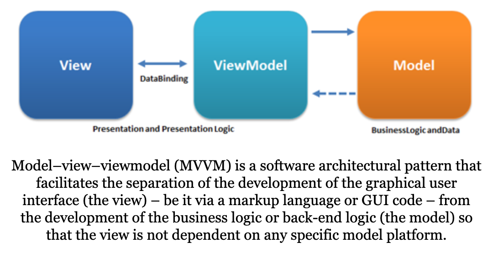
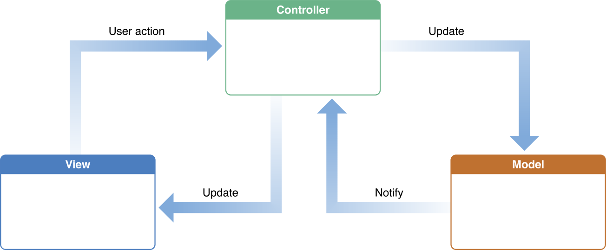
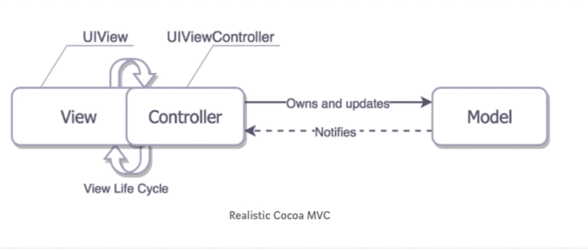
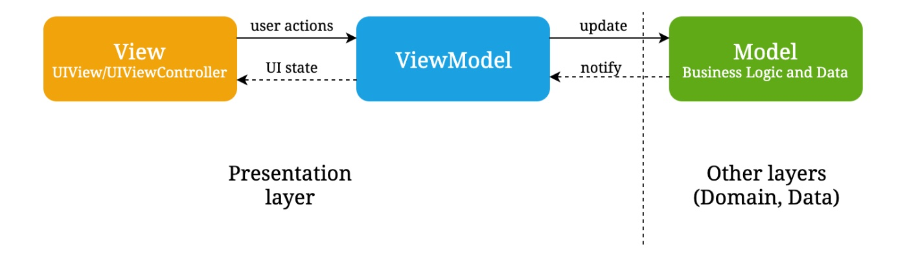

적합한 아키텍처 패턴을 적용해 iOS 애플리케이션을 개발할 수 있도록,
자주 사용되는 패턴들을 공부해봐야겠다는 생각이 들었습니다.
그래서 본 포스트에서는 MVVM 패턴에 대해 학습한 내용들을 정리해보려고 합니다.

이번 학습의 목표는 단순히 MVVM 패턴이 무엇인지 조사하는 레벨에 그치지 않고,
MVVM 패턴이 기존의 어떤 문제점들을 해결했으며
왜 널리 사용되고 있는지 충분히 이해하는 것입니다.

먼저 MVVM 패턴이 무엇인지 간략하게 소개하면서 시작해보겠습니다.

## 1. MVVM 패턴에 대한 간략한 소개

Wikipedia에서는 MVVM 패턴을 이렇게 소개합니다.

  https://en.wikipedia.org/wiki/Model%E2%80%93view%E2%80%93viewmodel

정리하면, MVVM 패턴이란...

- **Model-view-viewmodel**의 준말입니다.
- **아키텍처 패턴**의 일종입니다.
- **GUI와 비즈니스 로직을 분리**해 개발할 수 있도록 합니다.

Microsoft에서 발명되어
WPF와 Silverlight 개발에 사용된 것이 시초라고 합니다.
WPF와 Silverlight 프로젝트의 아키텍트였던
Josh Gossman이 2005년 당시에 작성한 포스트를 [링크](<(https://docs.microsoft.com/en-us/archive/blogs/johngossman/introduction-to-modelviewviewmodel-pattern-for-building-wpf-apps)>)합니다.
Model, View, ViewModel이 어떤 역할을 하는지에 대한 설명이 있습니다.

Wikipedia에서는 MVVM 패턴이 [Martin Fowler의 Presentation Model 패턴](https://martinfowler.com/eaaDev/PresentationModel.html)을
변형한 것이라고 하는데,
Gossman은 MVC 패턴을 변형한 것이라고 이야기하고 있네요.
조금 헷갈리지만, 일단은 PM 패턴과 MVC 패턴 모두에게 영향을 받았다고 생각하며 지나가겠습니다.

결국 MVVM 패턴은 소프트웨어라는 거대한 몸통을
Model, View, ViewModel이라는 세 덩어리로
나누어 개발하는 방법인 것 같습니다.
**뷰와 비즈니스 로직의 개발을 분리**하기 위해서요.

## 2. Why MVVM?

### a. Josh Gossman said...

Gossman의 포스트에 따르면, MVVM 패턴은 MVC 패턴을
현대적인 UI 개발 플랫폼에 맞춰 변형한 것이라고 합니다.

소프트웨어의 화면을 만드는 일은 개발자보단 디자이너의 책임입니다.
디자이너는 개발자에 비해 코드를 작성할 일이 적고,
HTML이나 WYSIWYG 툴 등 개발자와는 다른 도구를 사용합니다.
즉, 화면을 만드는 일과 비즈니스 로직을 만드는 일은
작업하는 사람도 다르고 사용되는 도구도 다르다 이겁니다.

일단 뷰를 비즈니스 로직과 분리해야 한다는 것은 알겠습니다.
하지만 Gossman의 포스트만으로는 왜 기존에 쓰던 MVC 패턴이 아니라
MVVM 패턴이 필요하게 된 것인지 잘 이해할 수 없었습니다.
어렵네요.

그래서 iOS 애플리케이션을 개발하는 관점에서
MVC 패턴을 사용하는 것과 MVVM 패턴을 사용하는 것이
어떻게 다른지 알아보려고 합니다.

### b. MVC 패턴으로 iOS 앱을 개발한다면

아래 이미지는 Apple에서 공개한 Cocoa MVC 패턴의 구조를 나타낸 것입니다.

  https://developer.apple.com/library/archive/documentation/General/Conceptual/DevPedia-CocoaCore/MVC.html

- Model은 앱의 데이터와 비즈니스 로직을 담당합니다.
- View는 사용자에게 데이터를 보여주기 위한 UI를 담당합니다.
- Controller는 View와 Model의 중간 다리 역할로,
  View로부터 사용자 액션을 전달받아 Model에게 알려주기도 하고
  Model의 데이터 변화를 View에게 알려주기도 합니다.
- 자세한 내용은 [Apple 문서](https://developer.apple.com/library/archive/documentation/General/Conceptual/DevPedia-CocoaCore/MVC.html)에서 확인할 수 있습니다.

기본적으로 iOS의 사용자 인터페이스 프레임워크인 UIKit가 MVC 패턴을 사용합니다.
하지만 이상적으로 생각했던 MVC 패턴은 없고,
View와 Controller가 너무 강하게 연결되어 있어 둘을 분리하는 것이 매우 어렵습니다.

  30개 프로젝트로 배우는 iOS 앱 개발 with Swift 초격차 패키지 Online. - 패스트캠퍼스

### c. MVVM 패턴으로 iOS 앱을 개발한다면

Model과 View의 역할은 MVC 패턴에서 보았던 것과 같습니다.
달라진 점은 Controller 대신에 ViewModel이 생겼다는 것입니다.

ViewModel은 View와 데이터 바인딩되어 있습니다.
데이터가 변경되는 경우 View를 업데이트 시켜주기 위함입니다.
이는 View와 ViewModel이 완전히 분리되어 있는 상태에서 동작하는 것입니다.

View와 ViewModel을 분리함으로써
각 요소마다 한 가지 책임만을 갖도록 구성할 수 있으며(SRP),
유닛 테스트를 진행하는게 훨씬 쉬워집니다.

## Reference

- [Model–view–viewmodel - Wikipedia](https://en.wikipedia.org/wiki/Model%E2%80%93view%E2%80%93viewmodel)
- [Introduction to Model/View/ViewModel pattern for building WPF apps - Microsoft Docs](https://docs.microsoft.com/en-us/archive/blogs/johngossman/introduction-to-modelviewviewmodel-pattern-for-building-wpf-apps)
- [30개 프로젝트로 배우는 iOS 앱 개발 with Swift 초격차 패키지 Online. - 패스트캠퍼스](https://fastcampus.co.kr/dev_online_iosappfinal)
- [iOS Architecture Patterns. Demystifying MVC, MVP, MVVM and VIPER - Bohdan Orlov](https://medium.com/ios-os-x-development/ios-architecture-patterns-ecba4c38de52)
