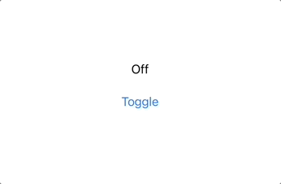

## 1. Property Wrapper

### a. Property Wrapper란

공식 문서에 따르면, Property Wrapper란 '프로퍼티가 어떻게 저장되는지 관리하는 코드와
프로피터를 정의하는 코드 둘을 분리하는 계층' 역할을 하는 기능입니다.

한 문장의 설명으로 이해하긴 어려운 것 같습니다.
특별한 연산을 거쳐 프로퍼티를 저장하고 싶은 경우,
Swift의 연산 프로퍼티 기능을 사용할 수 있습니다.
연산 프로퍼티를 정의하고 Setter에 어떤 연산을 할 것인지 작성하면 됩니다.

Property Wrapper를 사용하면 이런 연산 코드를
별도의 애노테이션으로 분리할 수 있습니다.
더 명시적이고 재사용성이 높은 코드를 작성할 수 있는 것 같습니다.

### b. Property Wrapper 예시

크기가 작은 직사각형을 표현하기 위해 `SmallRectangle`이라는 구조체를 정의한다고 합니다.
직사각형의 높이와 너비는 항상 12 이하입니다.
코드 레벨에서 이를 보장하려면, 아래와 같이 Swift의 연산 프로퍼티 기능을 사용할 수 있습니다.

```swift
struct SmallRectangle {
	private var _height: Int = 0
	private var _width: Int = 0

	var height: Int {
		get { return _height }
		set { _height = min(newValue, 12) }
	}

	var width: Int {
		get { return _width }
		set { _width = min(newValue, 12) }
	}

	init(height: Int, width: Int) {
		self.height = height
		self.width = width
	}
}

var rect = SmallRectangle(height: 15, width: 10)
print(rect.height, rect.width) // prints "12 10"
```

높이와 너비 모두 길이가 12 이하여야 한다는 조건이 같습니다.
`min(newValue, 12)`라는 동작을 높이와 너비에 대해 따로 작성하는 것은 중복된 로직입니다.
이 부분을 Property Wrapper로 분리할 수 있습니다.

```swift
@propertyWrapper
struct TwelveOrLess {
	private var number = 0
	var wrappedValue: Int {
		get { return number }
		set { number = min(newValue, 12) }
	}
}

struct SmallRectangle {
	@TwelveOrLess var height: Int
	@TwelveOrLess var width: Int
}

var rect = SmallRectangle()
rect.height = 15
rect.width = 10
print(rect.height, rect.width) // prints "12 10"
```

프로퍼티를 저장할 때 수행하고 싶은 연산을
Property Wrapper `@TwelveOrLess`에 분리했습니다.

Property Wrapper 안의 `wrappedValue`는 반드시 필요합니다.
프로퍼티 저장 시 어떤 연산을 수행할 것인지 작성하는 연산 프로퍼티입니다.

## 2. @State

Apple의 [SwiftUI Tutorials](https://developer.apple.com/tutorials/swiftui)에서
프로퍼티 앞에 `@State` 애노테이션을 붙여 뷰의 상태를 저장했습니다.
앞에서 Property Wrapper 이야기를 한 이유는,
SwiftUI의 `@State`도 Property Wrapper이기 때문입니다.

```swift
@available(iOS 13.0, macOS 10.15, tvOS 13.0, watchOS 6.0, *)
@frozen @propertyWrapper public struct State<Value> : DynamicProperty { ... }
```

SwiftUI는 `@State`로 선언된 프로퍼티들을 관리하며,
만약 값이 변경되면 해당 프로퍼티의 값에 의존하는 뷰들을 업데이트합니다.

만약 `@State` 프로퍼티를 하위 뷰와 같은 다른 뷰에 전달하려면,
이름 앞에 `$`를 붙여 Property Wrapper 자체를 전달할 수 있습니다.
전달 받는 뷰에서는 Property Wrapper 안에 있는 wrappedValue를 수정할 수 있으므로,
수정한 값은 물론 원본 뷰에서도 똑같이 반영됩니다.

## 3. @Binding

`@State` 프로퍼티를 다른 뷰에 전달하는 경우,
`@Binding` 프로퍼티를 통해 해당 Property Wrapper를 받아올 수 있습니다.

`@Binding` 또한 Property Wrapper이므로, 사용하는 방법은 비슷합니다.
프로퍼티 앞에 애노테이션을 붙이면 됩니다.

앞서 언급한 것처럼, Property Wrapper 자체를 받아오는 것이기 때문에
안에 있는 wrappedValue에 접근해 값을 변경하는 것이 됩니다.

## 4. @State와 @Binding 예시

`@State`와 `@Binding`의 개념을 확인할 수 있는
가장 간단한 예제 코드를 작성했습니다.

Property Wrapper를 통해 선언된 뷰의 상태 `isOn`을
`ToggleButton` 뷰에서 받아와 수정하고 있습니다.

```swift
import SwiftUI

struct ContentView: View {
	@State var isOn = false

	var body: some View {
		VStack {
			Text(isOn ? "On" : "Off")
				.padding()

			ToggleButton(isOn: $isOn)
		}
	}
}

struct ToggleButton: View {
	@Binding var isOn: Bool

	var body: some View {
		Button {
			isOn.toggle()
		} label: {
			Text("Toggle")
		}
	}
}
```



## Reference

- [Properties — The Swift Programming Language (Swift 5.7)](https://docs.swift.org/swift-book/LanguageGuide/Properties.html)
- [Property Wrapper - ZeddiOS](https://zeddios.tistory.com/1221)
- [[Swift] ProperyWrapper를 이용한 값처리 - Harry The Great](https://medium.com/harrythegreat/swift-properywrapper%EB%A5%BC-%EC%9D%B4%EC%9A%A9%ED%95%9C-%EA%B0%92%EC%B2%98%EB%A6%AC-a8ef0d87e8e)
- [SwiftUI 튜토리얼 5편 — @State, @Binding, @ObservedObject - Harry The Great](https://medium.com/harrythegreat/swiftui-%ED%8A%9C%ED%86%A0%EB%A6%AC%EC%96%BC-5%ED%8E%B8-state-binding-observedobject-83c00c3317cb)
- [[Swift] @State는 무엇일까? - loopbackseal.log](https://velog.io/@loopbackseal/Swift-State%EB%8A%94-%EB%AC%B4%EC%97%87%EC%9D%BC%EA%B9%8C)
